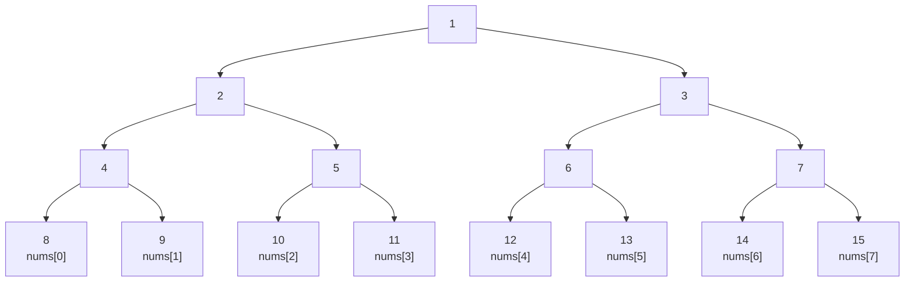

# Cheat Sheet

## 一、常用但不太常用的函数

### 1、内置非库函数

| 名称                                   | 功能                       |
| -------------------------------------- | -------------------------- |
| `bin(n:int)`/`oct(n:int)`/`hex(n:int)` | 整数转二/八/十六进制字符串 |
| `eval(s:str)`                          | 对字符串对应的代码求值     |
| `exec(s:str)`                          | 执行字符串对应代码         |

### **2、collections**

| `deque(iterable)`        | **双端队列**                                                 |
| ------------------------ | ------------------------------------------------------------ |
| `q.append(x)`            | 添加 *x* 到q右端                                             |
| `q.appendleft(x)`        | 添加 *x* 到q左端                                             |
| `q.popleft()`            | 移除并返回q最左端元素                                        |
| `q.pop()`                | 移除并返回q最右端元素                                        |
| `q.extend(iterable)`     | q右端添加多个元素                                            |
| `q.extendleft(iterable)` | q左端添加多个元素（按iterable顺序依次插入）                  |
| `q.rotate(n:int)`        | 将 q 旋转 n 次（若 n 为正则将右侧的元素移到左侧，若 n 为负则相反） |

| `Counter(iterable-or-mapping)` | 计数器                                                       |
| ------------------------------ | ------------------------------------------------------------ |
| `c.elements()`                 | 返回一个迭代器，其中每个元素将重复出现计数值所指定次，元素按首次出现的顺序返回 |
| `c.most_common(n:int)`         | 返回一个列表，包含计数最高的 n 个元素及其计数，按从高到低排序 |
| `c+d`                          | `c[x] + d[x]`                                                |
| `c-d`                          | `c[x] - d[x]` ，只保留正数                                   |
| `c&d`                          | 交集：`min(c[x], d[x])`                                      |
| `c|d`                          | 并集：` max(c[x], d[x])`                                     |
| `c == d`                       | 相等： `c[x] == d[x]`                                        |
| `c <= d`                       | 包含：` c[x] <= d[x]`                                        |

| `defaultdict(default_factory,dict)` | 默认字典     |
| ----------------------------------- | ------------ |
| `defaultdict(int)`                  | 默认值为0    |
| `defaultdict(list)`                 | 默认值为`[]` |
| `defaultdict(lambda:v)`             | 默认值为v    |

| `OrderedDict(dict)`             | 有序字典(按首次插入顺序排列)                                 |
| ------------------------------- | ------------------------------------------------------------ |
| `od.popitem(last=True)`         | 如果 last 为`True`弹出并返回od最右端键值对，否则返回od最左端键值对 |
| `od.move_to_end(key,last=True)` | 如果 last 为`True`则将key移到od右端，否则将key移到od左端     |

### **3、functools**

| 名称                         | 功能                                                         |
| ---------------------------- | ------------------------------------------------------------ |
| `@lru_cache(maxsize=128)`    | 模拟记忆化搜索，可以把maxsize设为`None`                      |
| `reduce(function, iterable)` | 将两个参数的 function从左至右累积地应用到 iterable的元素     |
| `cmp_to_key(function)`       | 将（旧式的）比较函数function（小于返回负值，等于返回0，大于返回正值）转换为新式的键函数，用于`sort()`等重载比较规则 |

### **4、random**

| 名称                                                      | 功能                                                         |
| --------------------------------------------------------- | ------------------------------------------------------------ |
| `seed(a=None)`                                            | 初始化随机数生成器。如果a被省略或为 `None` ，则使用当前系统时间。 |
| `randrange(start, stop, step)`                            | 返回从 `range(start, stop, step)` 随机选择的一个元素         |
| `randint(a, b)`                                           | 相当于 `randrange(a, b+1)`                                   |
| `getrandbits(k)`                                          | 返回具有 k个随机比特位的非负整数                             |
| `choice(seq)`                                             | 从非空序列seq返回一个随机元素                                |
| `choices(population, weights=None,cum_weights=None, k=1)` | 从population中有重复地随机选取元素，返回大小为 k的元素列表，如果指定了weight序列，则根据相对权重进行选择；如果给出cum_weights序列，则根据累积权重进行选择 |
| `shuffle(x)`                                              | 原地将可变序列x随机打乱位置                                  |
| `sample(population, k, counts=None)`                      | 返回从population中选取的唯一元素的长度为k的列表，如果population包含重复，则重复元素按频次可以重复出现，元素出现次数可用列表counts指定 |

### **5、heapq**

| 名称                                         | 功能                                                         |
| -------------------------------------------- | ------------------------------------------------------------ |
| `heapify(x:list)`                            | `O(len(x))`将x转化成堆（`x[0]=min(x),x[k]<=min(x[2*k+1],x[2*k+2])`） |
| `heappush(heap, item)`                       | 将item的值加入heap中，保持堆的不变性                         |
| `heappop(heap)`                              | 弹出并返回heap的最小的元素，保持堆的不变性                   |
| `heappushpop(heap, item)`                    | 将item放入堆中，然后弹出并返回heap的最小元素                 |
| `heapreplace(heap, item)`                    | 弹出并返回heap中最小的一项，同时推入新的item                 |
| `nlargest(n, iterable, key=None)`            | `O(len(iterable)*log(n))`从 iterable所定义的数据集中返回前n个最大元素组成的列表，key为比较规则 |
| `nsmallest(n, iterable, key=None)`           | `O(len(iterable)*log(n))`从 iterable所定义的数据集中返回前n个最小元素组成的列表，key为比较规则 |
| `merge(*iterables, key=None, reverse=False)` | 将多个已排序的输入合并为一个已排序的输出，key为比较规则      |

### **6、math**

| 名称                | 功能                 |
| ------------------- | -------------------- |
| `comb(n:int,k:int)` | 组合数               |
| `factorial(n:int)`  | 阶乘                 |
| `gcd(*integers)`    | 多个整数的最大公约数 |
| `isqrt(n:int)`      | 平方根下取整         |
| `lcm(*integers)`    | 多个整数的最小公倍数 |
| `perm(n:int,k:int)` | 排列数               |
| `ceil(x:float)`     | 浮点数上取整         |
| `fabs(x:flaot)`     | 浮点数绝对值         |

## **二、常用但不太常用的算法**

### **1、树状数组**

```python
n=len(nums)
tree=[0]*(n+1)#下标0不使用
lowbit=lambda x:x&(-x)

def update(x,v):#单点x加v
    while x<=n:
        tree[x]+=v
        x+=lowbit(x)
        
def query(x):#求闭区间[1,x]的和
    sums=0
    while x>0:
        sums += tree[x]
        x-=lowbit(x)
    return sums
```

```python
n=len(nums)
tree=[0]*(n+1)#下标0不使用
lowbit=lambda x:x&(-x)

def update(x,v):#闭区间[1,x]加v
    while x>0:
        tree[x] += v
        x-=lowbit(x)
        
def query(x):#求单点x的值
    sums=0
    while x<=n:
        sums+=tree[x]
        x+=lowbit(x)
    return sums
```

### **2、ZKW线段树**

```python
n=len(nums)
N=1<<n.bit_length()
tree=[0]*N+nums+[0]*(N-n)#下标0不使用
for i in range(N-1,0,-1):tree[i]=tree[2*i]+tree[2*i+1]

def update(x,v):#单点x加v
    x+=N
    while x:
        tree[x]+=v
        x//=2
        
def query(l,r):#求开区间(l,r)的和
    sums=0
    l+=N
    r+=N
    while r-l!=1:
        if l%2==0:sums+=tree[l+1]
        if r%2==1:sums+=tree[r-1]
        l//=2
        r//=2
    return sums
```



### **3、KMP算法**

```python
m,n=len(pattern),len(text)
next = [-1] + [0] * m
j = -1
for i in range(1,m):
    while j != -1 and pattern[i] != pattern[j+ 1]: j =next[j]
    if pattern[i]==pattern[j+1]:j+=1
    next[i] = j
#next[i]表示pattern[:i+1]最长相等前后缀最后一位的下标，即pattern[:k+1]==pattern[-k-1:]的最大k

j = -1
for i in range(n):
    while j != -1 and text[i] != pattern[j + 1]: j = next[j]
    if text[i] == pattern[j + 1]: j += 1
    if j == m-1:break #此时i即为第一次匹配处最后一位的下标，即text[i-m+1:i+1]==pattern

counts,j = 0,-1
for i in range(n):
    while j != -1 and text[i] != pattern[j + 1]: j = next[j]
    if text[i] == pattern[j + 1]: j += 1
    if j == m-1:
        counts+=1
        j=next[j]
#counts为总匹配次数
```

### **4、当前队列中位数**

```python
from collections import defaultdict
import heapq

class DualHeap:
    def __init__(self):
        self.small = []#这里存放的元素要取相反数
        self.large = []
        self.delayed = defaultdict(int)
        self.small_size = 0
        self.large_size = 0

    def prune(self, heap):
        if heap is self.small:
            while heap and self.delayed[-heap[0]]:
                self.delayed[-heapq.heappop(heap)] -= 1
        else:
            while heap and self.delayed[heap[0]]:
                self.delayed[heapq.heappop(heap)] -= 1

    def balance(self):
        if self.small_size - self.large_size>1:
            self.prune(self.small)
            heapq.heappush(self.large, -heapq.heappop(self.small))
            self.small_size -= 1
            self.large_size += 1
        elif self.small_size < self.large_size:
            self.prune(self.large)
            heapq.heappush(self.small, -heapq.heappop(self.large))
            self.small_size += 1
            self.large_size -= 1

    def add_num(self, v):
        if not self.small or v <= -self.small[0]:
            heapq.heappush(self.small, -v)
            self.small_size += 1
        else:
            heapq.heappush(self.large, v)
            self.large_size += 1
        self.balance()

    def del_num(self, v):
        self.delayed[v] += 1
        if self.small and v <= -self.small[0]:
            self.small_size -= 1
            if v == -self.small[0]:self.prune(self.small)
        else:
            self.large_size -= 1
            if self.large and v == self.large[0]:self.prune(self.large)
        self.balance()
    #注意删除元素之后要及时清除堆顶无效元素

    def find_mid(self):
        self.prune(self.small)
        self.prune(self.large)
        total = self.small_size + self.large_size
        if total % 2 == 1:return -self.small[0]
        else:return (-self.small[0] + self.large[0]) / 2
```

```python
#O(n^2)代码，但常数较小
from bisect import bisect_left
nums= []
find_mid=lambda:(nums[(len(nums)-1)//2]+nums[len(nums)//2])/2
def add_num(v):nums.insert(bisect_left(nums, v), v)
def del_num(v):nums.pop(bisect_left(nums, v))
```

**（其实`insert`和`pop`的常数挺小的，50000长度列表开头反复增删元素50000次，用时不超过10s）**

### 5、关键路径

```python
from collections import deque
n,m=map(int,input().split())
g=[[] for _ in range(n)]
d=[0]*n
for _ in range(m):
    u,v,t=map(int,input().split())
    g[u].append((v,t)) #记录子节点及边权
    d[v]+=1

q=deque()
topo_order=[]
early=[0]*n #最早开始时间
for u in range(n):
    if not d[u]:
        q.append(u)
        topo_order.append(u)
while q:
    u=q.popleft()
    for v,t in g[u]:
        if d[v]:
            d[v]-=1
            early[v] = max(early[v], early[u] + t) #按拓扑序更新最早开始时间
        if not d[v]:
            q.append(v)
            topo_order.append(v)
late=[max(early)]*n #最晚结束时间
for u in reversed(topo_order):
    for v,t in g[u]:
        late[u]=min(late[u],late[v]-t) #按逆拓扑序更新最晚结束时间

#max(early)为最短用时
#满足early[u]+t==late[v]的边(u,v)为关键路径
```

### 6、强连通单元 ###

```python
#Kosaraju算法
n,m=map(int,input().split())
g,g_inv=[[] for _ in range(n)],[[] for _ in range(n)]#原图和反图
for _ in range(m):
    u,v=map(int,input().split())
    g[u].append(v)
    g_inv[v].append(u)
    
check=[False]*n
stack=[]
def dfs1(u):
    check[u] = True
    for v in g[u]:
        if not check[v]:dfs1(v)
    stack.append(u)
for u in range(n):
    if not check[u]:dfs1(u)

check=[False]*n
cur,scc=[],[]
def dfs2(u):
    check[u] = True
    cur.append(u)
    for v in g_inv[u]:
        if not check[v]:dfs2(v)
for u in reversed(stack):
    if not check[u]:
        dfs2(u)
        scc.append(cur)
        cur=[]
#scc数组中记录所有强连通分量
```

```python
#Tarjan算法
n,m=map(int,input().split())
g=[[] for _ in range(n)]
for _ in range(m):
    u,v=map(int,input().split())
    g[u].append(v)
    
on_stack=[False]*n
stack,scc=[],[]
indices,low_link=[0]*n,[0]*n
ind=0
def dfs(u):
    global ind
    ind+=1
    indices[u]=low_link[u]=ind
    stack.append(u)
    on_stack[u] = True

    for v in g[u]:
        if not indices[v]:
            dfs(v)
            low_link[u]=min(low_link[u],low_link[v])
        elif on_stack[v]:
            low_link[u]=min(low_link[u],indices[v])

    if indices[u]==low_link[u]:
        cur=[]
        while True:
            v=stack.pop()
            on_stack[v]=False
            cur.append(v)
            if v==u:break
        scc.append(cur)

for u in range(n):
    if not indices[u]:dfs(u)
#scc数组中记录所有强连通分量
```


## **三、一些辅助代码**

### **1、递归防爆栈**

**codeforces需要用如下装饰器**

```python
from types import GeneratorType
def bootstrap(f, stack=[]):
    def wrapped_func(*args, **kwargs):
        if stack:
            return f(*args, **kwargs)
        else:
            to = f(*args, **kwargs)
            while True:
                if type(to) is GeneratorType:
                    stack.append(to)
                    to = next(to)
                else:
                    stack.pop()
                    if not stack:
                        break
                    to = stack[-1].send(to)
            return to
    return wrapped_func
#把“return”全部改成“yield”,再在每次递归调用函数前额外添加“yield”
```

**在oj上可以直接使用如下代码调大递归深度限制**

```python
from sys import setrecursionlimit
setrecursionlimit(10**6)
```

### **2、程序运行计时**

```python
from time import time
start_time = time()
#这里插入程序代码
end_time = time()
print("运行时间：", end_time - start_time, "秒")
```

### 3、快读 ###

```python
from sys import stdin
data = stdin.read()#一次性读所有数据
data = stdin.read().split()#按照空格和换行切分数据
```

