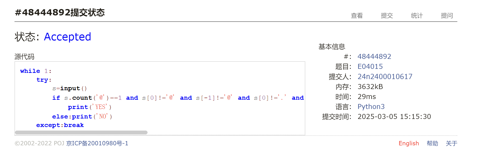
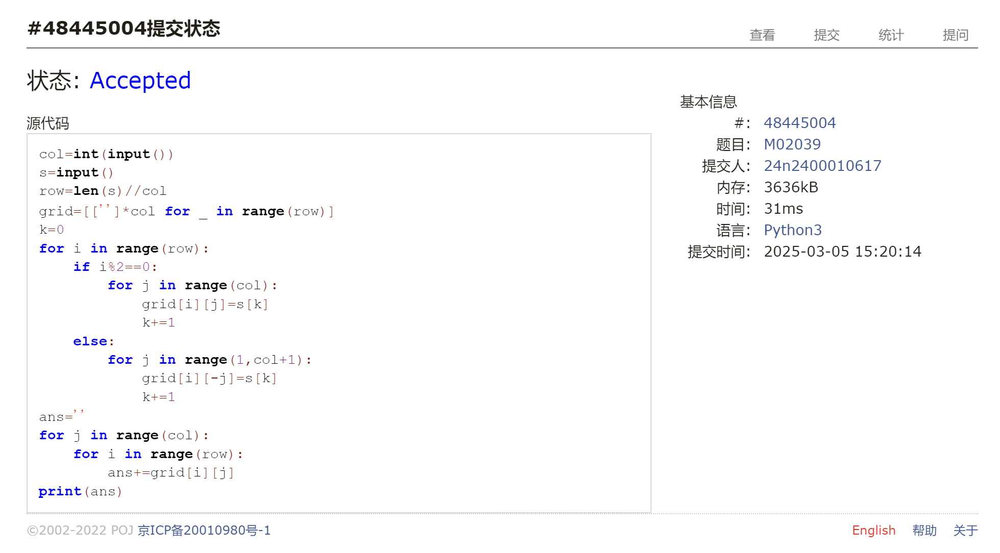
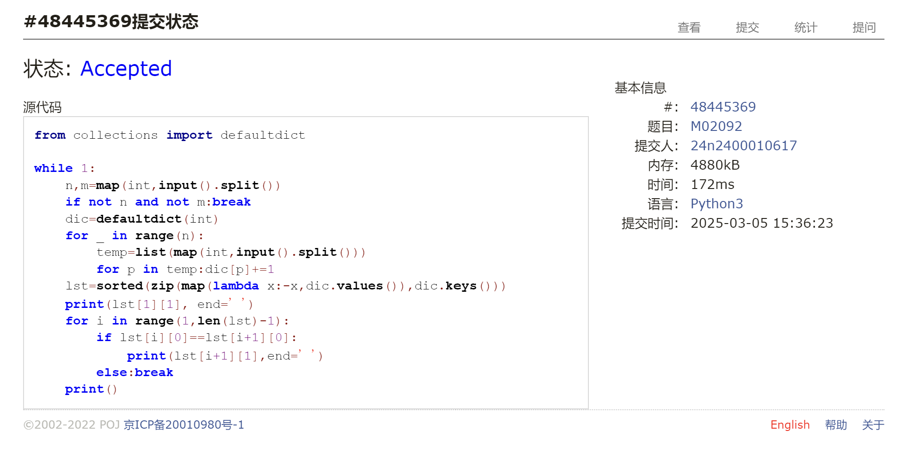
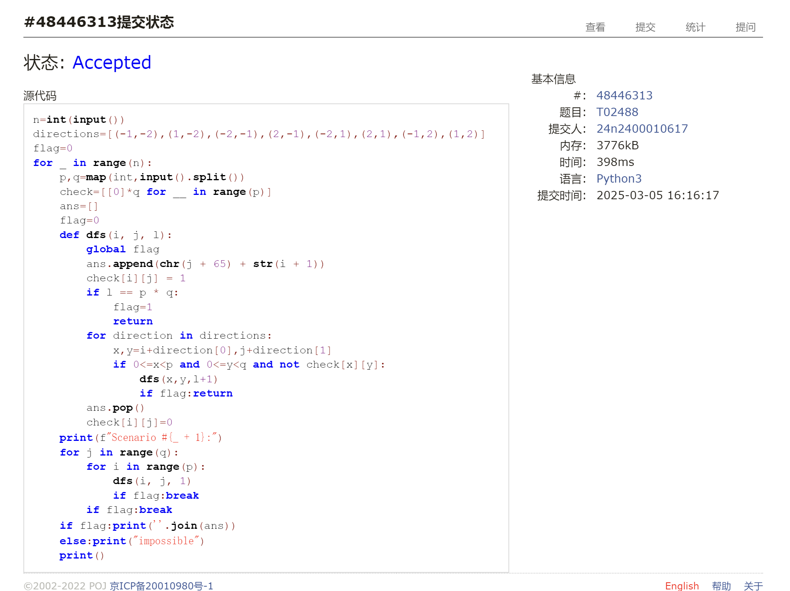
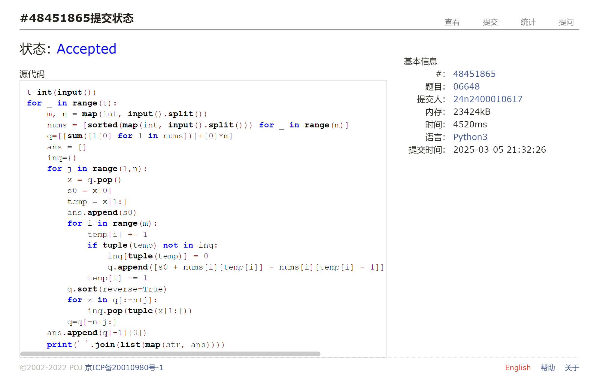

# Assignment #3: 惊蛰 Mock Exam

Updated 1641 GMT+8 Mar 5, 2025

2025 spring, Complied by <mark>蔡沐轩 数学科学学院</mark>


> **说明：**
>
> 1. **惊蛰⽉考**：<mark>AC5</mark> 。考试题⽬都在“题库（包括计概、数算题目）”⾥⾯，按照数字题号能找到，可以重新提交。作业中提交⾃⼰最满意版本的代码和截图。
>
> 2. **解题与记录：**
>
>    对于每一个题目，请提供其解题思路（可选），并附上使用Python或C++编写的源代码（确保已在OpenJudge， Codeforces，LeetCode等平台上获得Accepted）。请将这些信息连同显示“Accepted”的截图一起填写到下方的作业模板中。（推荐使用Typora https://typoraio.cn 进行编辑，当然你也可以选择Word。）无论题目是否已通过，请标明每个题目大致花费的时间。
>
> 3. **提交安排：**提交时，请首先上传PDF格式的文件，并将.md或.doc格式的文件作为附件上传至右侧的“作业评论”区。确保你的Canvas账户有一个清晰可见的头像，提交的文件为PDF格式，并且“作业评论”区包含上传的.md或.doc附件。
>
> 4. **延迟提交：**如果你预计无法在截止日期前提交作业，请提前告知具体原因。这有助于我们了解情况并可能为你提供适当的延期或其他帮助。 
>
> 请按照上述指导认真准备和提交作业，以保证顺利完成课程要求。


## 1. 题目

### E04015: 邮箱验证

strings, http://cs101.openjudge.cn/practice/04015


思路：

直接条件判定即可。约7min。

代码：

```python
while 1:
    try:
        s=input()
        if s.count('@')==1 and s[0]!='@' and s[-1]!='@' and s[0]!='.' and s[-1]!='.' and s.find('@.')==-1 and s.find('.@')==-1 and s[s.find('@'):].find('.')!=-1:
            print('YES')
        else:print('NO')
    except:break
```


代码运行截图 <mark>（至少包含有"Accepted"）</mark>




### M02039: 反反复复

implementation, http://cs101.openjudge.cn/practice/02039/


思路：

先按行还原成矩阵，然后再按列遍历得到结果。约5min。

代码：

```python
col=int(input())
s=input()
row=len(s)//col
grid=[['']*col for _ in range(row)]
k=0
for i in range(row):
    if i%2==0:
        for j in range(col):
            grid[i][j]=s[k]
            k+=1
    else:
        for j in range(1,col+1):
            grid[i][-j]=s[k]
            k+=1
ans=''
for j in range(col):
    for i in range(row):
        ans+=grid[i][j]
print(ans)
```


代码运行截图 <mark>（至少包含有"Accepted"）</mark>




### M02092: Grandpa is Famous

implementation, http://cs101.openjudge.cn/practice/02092/


思路：

直接统计每个选手出现的次数，然后将出现次数与选手编号组成元组进行排序，由于恰好存在一个最佳选手，只要从排序后的索引1开始逐个输出选手编号即可。约16min。（英文题干看得好累）

代码：

```python
from collections import defaultdict

while 1:
    n,m=map(int,input().split())
    if not n and not m:break
    dic=defaultdict(int)
    for _ in range(n):
        temp=list(map(int,input().split()))
        for p in temp:dic[p]+=1
    lst=sorted(zip(map(lambda x:-x,dic.values()),dic.keys()))
    print(lst[1][1], end=' ')
    for i in range(1,len(lst)-1):
        if lst[i][0]==lst[i+1][0]:
            print(lst[i+1][1],end=' ')
        else:break
    print()
```


代码运行截图 <mark>（至少包含有"Accepted"）</mark>




### M04133: 垃圾炸弹

matrices, http://cs101.openjudge.cn/practice/04133/


思路：

用二位数组`grid`记录每个投放点可以清除的垃圾数目。计算数组值时，只需要对每堆垃圾，在每个能炸到垃圾的投放点上加上垃圾数量，最后遍历`grid`选出值最大的投放点并计数即可。约6min。

代码：

```python
d=int(input())
n=int(input())
grid=[[0]*1025 for _ in range(1025)]
for _ in range(n):
    x,y,i=map(int,input().split())
    for row in range(max(x-d,0),min(x+d+1,1025)):
        for col in range(max(y-d,0),min(y+d+1,1025)):
            grid[row][col]+=i
mx,num=0,1
for row in range(1025):
    for col in range(1025):
        if grid[row][col]>mx:mx,num=grid[row][col],1
        elif grid[row][col]==mx:num+=1
print(num,mx)
```


代码运行截图 <mark>（至少包含有"Accepted"）</mark>


### T02488: A Knight's Journey

backtracking, http://cs101.openjudge.cn/practice/02488/


思路：

骑士周游，dfs回溯即可。为了保证字典序，一是要按照`directions=[(-1,-2),(1,-2),(-2,-1),(2,-1),(-2,1),(2,1),(-1,2),(1,2)]`的顺序遍历相邻格子，二是在逐次进行`dfs(i, j, 1)`时要按照先列后行的顺序，直到找到第一个结果即可输出。约34min。

代码：

```python
n=int(input())
directions=[(-1,-2),(1,-2),(-2,-1),(2,-1),(-2,1),(2,1),(-1,2),(1,2)]
flag=0
for _ in range(n):
    p,q=map(int,input().split())
    check=[[0]*q for __ in range(p)]
    ans=[]
    flag=0
    def dfs(i, j, l):
        global flag
        ans.append(chr(j + 65) + str(i + 1))
        check[i][j] = 1
        if l == p * q:
            flag=1
            return
        for direction in directions:
            x,y=i+direction[0],j+direction[1]
            if 0<=x<p and 0<=y<q and not check[x][y]:
                dfs(x,y,l+1)
                if flag:return
        ans.pop()
        check[i][j]=0
    print(f"Scenario #{_ + 1}:")
    for j in range(q):
        for i in range(p):
            dfs(i, j, 1)
            if flag:break
        if flag:break
    if flag:print(''.join(ans))
    else:print("impossible")
    print()
```


代码运行截图 <mark>（至少包含有"Accepted"）</mark>




### T06648: Sequence

heap, http://cs101.openjudge.cn/practice/06648/


思路：

基本想法和BFS有点像：数组先排序，优先队列存储总和和对应每个数组中取出的元素下标，每次访问优先队列中的最小元素，加入`ans`列表，然后将该求和对应取法的其中一个下标加1，共m种情况入队，直到`ans`中取够n个元素即可。证明是容易的，因为每个求和要想进入`ans`，必须等比它小的元素全部进入`ans`之后才有可能，将该求和对应取法的其中一个下标减1，总和不增，故可以在访问这一较小求和之后才将该求和入队。

考试的时候其实已经按照这个思路写完代码了，但是有两个细节没处理好，导致无法通过。

一是照此思路，优先队列中要存m+1元组，每次弹出1个，压入m个，重复n次，空间复杂度就达到了恐怖的$O(m^2n) $，不出所料就MLE了。考完后想到一种显然的优化：由于只要输出前n小的求和，那么优先队列在第j次操作后只要存n-j个数据即可，这就将空间复杂度压到了$O(mn) $，不会MLE了。当然，这样一来索性也没必要用`heapq`了，直接改用列表进行排序和切片会更容易。

二是这个思路下同一种取法会多次被加入队列，这是我考完调试了半天无果，去查测试数据才发现的问题。解决方案可以是建一个`inq`字典，当然这里也得及时删除元素，不然同样会MLE，按照前述做法只需在列表切片时把切掉的部分从字典中踢出即可。

最后估算一下时间复杂度，一共m次排序，每次列表长度大约$O(n)$，总复杂度$O(mn\log n)$，可以通过。可能常数大了点，跑得比较慢。

考试时候做了约1h，回去又调试了1h，还是在看了测试用例的情况下才成功AC。

看了同学和题解的代码，发现只要先处理两个数组的情形，然后再逐步合并m个数组即可，这样之前的两个问题都完全不用考虑了。感觉自己优化了半天，代码效率还是比不上🤡。

代码：

```python
t=int(input())
for _ in range(t):
    m, n = map(int, input().split())
    nums = [sorted(map(int, input().split())) for _ in range(m)]
    q=[[sum([l[0] for l in nums])]+[0]*m]
    ans = []
    inq={}
    for j in range(1,n):
        x = q.pop()
        s0 = x[0]
        temp = x[1:]
        ans.append(s0)
        for i in range(m):
            temp[i] += 1
            if tuple(temp) not in inq:
                inq[tuple(temp)] = 0
                q.append([s0 + nums[i][temp[i]] - nums[i][temp[i] - 1]] + temp.copy())
            temp[i] -= 1
        q.sort(reverse=True)
        for x in q[:-n+j]:
            inq.pop(tuple(x[1:]))
        q=q[-n+j:]
    ans.append(q[-1][0])
    print(' '.join(list(map(str, ans))))
```


代码运行截图 ==（AC代码截图，至少包含有"Accepted"）==




## 2. 学习总结和收获

<mark>如果发现作业题目相对简单，有否寻找额外的练习题目，如“数算2025spring每日选做”、LeetCode、Codeforces、洛谷等网站上的题目。</mark>

考试的难题还是做不出来，参加了上周的leetcode双周赛和周赛也都只有AC2，感觉自己思维上还是有待提升。

考试做前几题赶时间的时候会非常紧张，到后面才逐渐稳定心态，希望自己能逐渐适应考试状态。

今天最后一题这种化多个数组为两个数组逐次处理的思路非常值得学习，又长见识了。
