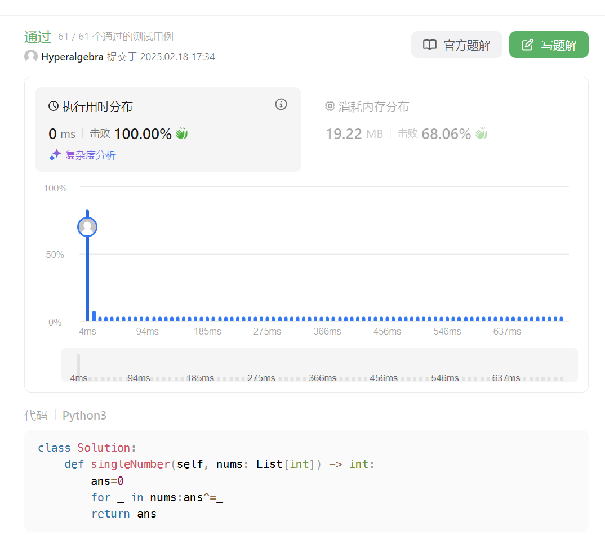
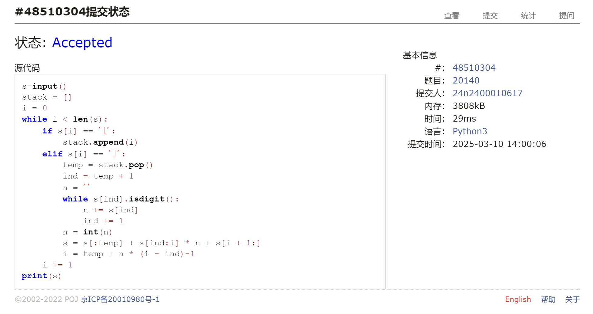
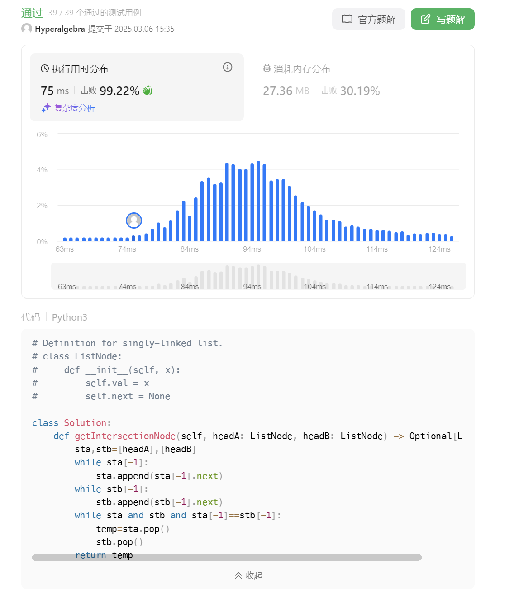
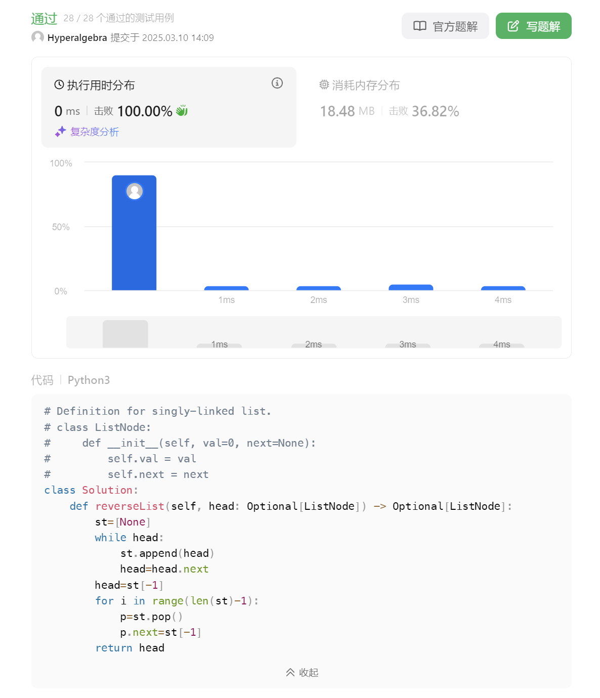
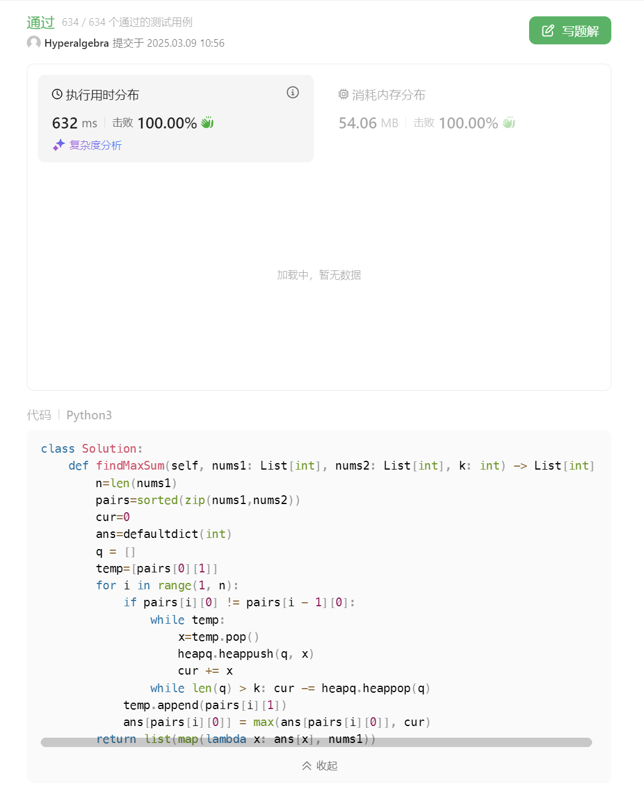
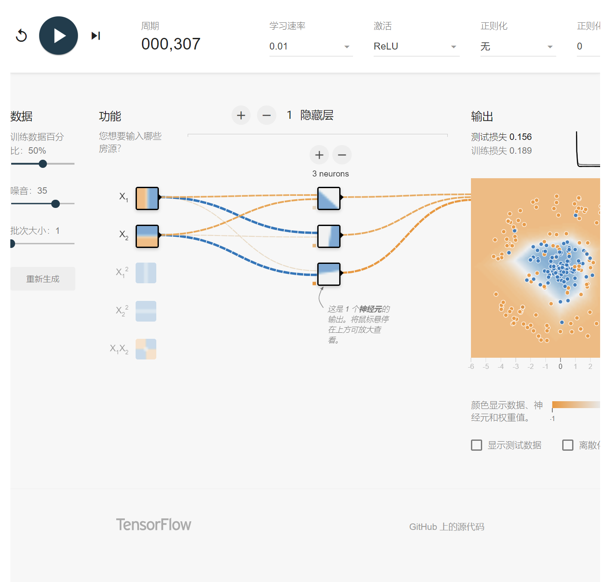

# Assignment #4: 位操作、栈、链表、堆和NN

Updated 1203 GMT+8 Mar 10, 2025

2025 spring, Complied by <mark>蔡沐轩 数学科学学院</mark>


> **说明：**
>
> 1. **解题与记录：**
>
>    对于每一个题目，请提供其解题思路（可选），并附上使用Python或C++编写的源代码（确保已在OpenJudge， Codeforces，LeetCode等平台上获得Accepted）。请将这些信息连同显示“Accepted”的截图一起填写到下方的作业模板中。（推荐使用Typora https://typoraio.cn 进行编辑，当然你也可以选择Word。）无论题目是否已通过，请标明每个题目大致花费的时间。
>
> 2. **提交安排：**提交时，请首先上传PDF格式的文件，并将.md或.doc格式的文件作为附件上传至右侧的“作业评论”区。确保你的Canvas账户有一个清晰可见的头像，提交的文件为PDF格式，并且“作业评论”区包含上传的.md或.doc附件。
>
> 3. **延迟提交：**如果你预计无法在截止日期前提交作业，请提前告知具体原因。这有助于我们了解情况并可能为你提供适当的延期或其他帮助。 
>
> 请按照上述指导认真准备和提交作业，以保证顺利完成课程要求。


## 1. 题目

### 136.只出现一次的数字

bit manipulation, https://leetcode.cn/problems/single-number/

利用异或运算，两个相同的数异或结果为0，所有数异或的最终结果即为只出现一次的数。约2min。

<mark>请用位操作来实现，并且只使用常量额外空间。</mark>


代码：

```python
class Solution:
    def singleNumber(self, nums: List[int]) -> int:
        ans=0
        for _ in nums:ans^=_
        return ans
```


代码运行截图 <mark>（至少包含有"Accepted"）</mark>




### 20140:今日化学论文

stack, http://cs101.openjudge.cn/practice/20140/


思路：

用栈存储左括号，扫到右括号时从栈顶弹出对应的左括号，然后把两括号之间的字符串复制相应次数即可。约10min。

代码：

```python
s=input()
stack = []
i = 0
while i < len(s):
    if s[i] == '[':
        stack.append(i)
    elif s[i] == ']':
        temp = stack.pop()
        ind = temp + 1
        n = ''
        while s[ind].isdigit():
            n += s[ind]
            ind += 1
        n = int(n)
        s = s[:temp] + s[ind:i] * n + s[i + 1:]
        i = temp + n * (i - ind)-1
    i += 1
print(s)
```


代码运行截图 <mark>（至少包含有"Accepted"）</mark>




### 160.相交链表

linked list, https://leetcode.cn/problems/intersection-of-two-linked-lists/


思路：

遍历两个链表各一次，存储路径在栈中，再依次出栈找出路径中第一个相同节点。约5min。

代码：

```python
class Solution:
    def getIntersectionNode(self, headA: ListNode, headB: ListNode) -> Optional[ListNode]:
        sta,stb=[headA],[headB]
        while sta[-1]:
            sta.append(sta[-1].next)
        while stb[-1]:
            stb.append(stb[-1].next)
        while sta and stb and sta[-1]==stb[-1]:
            temp=sta.pop()
            stb.pop()
        return temp
```


代码运行截图 <mark>（至少包含有"Accepted"）</mark>




### 206.反转链表

linked list, https://leetcode.cn/problems/reverse-linked-list/


思路：

遍历链表，节点存储在栈中，再依次出栈并修改后继结点。约5min。

代码：

```python
class Solution:
    def reverseList(self, head: Optional[ListNode]) -> Optional[ListNode]:
        st=[None]
        while head:
            st.append(head)
            head=head.next
        head=st[-1]
        for i in range(len(st)-1):
            p=st.pop()
            p.next=st[-1]
        return head
```


代码运行截图 <mark>（至少包含有"Accepted"）</mark>




### 3478.选出和最大的K个元素

heap, https://leetcode.cn/problems/choose-k-elements-with-maximum-sum/


思路：

将`nums1`与`nums2`的元素配对并排序，依次遍历，维护一个长度为`k`的`heapq`，以及这`k`个元素总和，用字典存储`nums1`每个数值对应的结果，最后再赋值给`nums1` 每个元素即可。约23min。

代码：

```python
class Solution:
    def findMaxSum(self, nums1: List[int], nums2: List[int], k: int) -> List[int]:
        n=len(nums1)
        pairs=sorted(zip(nums1,nums2))
        cur=0
        ans=defaultdict(int)
        q = []
        temp=[pairs[0][1]]
        for i in range(1, n):
            if pairs[i][0] != pairs[i - 1][0]:
                while temp:
                    x=temp.pop()
                    heapq.heappush(q, x)
                    cur += x
                while len(q) > k: cur -= heapq.heappop(q)
            temp.append(pairs[i][1])
            ans[pairs[i][0]] = max(ans[pairs[i][0]], cur)
        return list(map(lambda x: ans[x], nums1))
```


代码运行截图 <mark>（至少包含有"Accepted"）</mark>




### Q6.交互可视化neural network

https://developers.google.com/machine-learning/crash-course/neural-networks/interactive-exercises

**Your task:** configure a neural network that can separate the orange dots from the blue dots in the diagram, achieving a loss of less than 0.2 on both the training and test data.

**Instructions:**

In the interactive widget:

1. Modify the neural network hyperparameters by experimenting with some of the following config settings:
   - Add or remove hidden layers by clicking the **+** and **-** buttons to the left of the **HIDDEN LAYERS** heading in the network diagram.
   - Add or remove neurons from a hidden layer by clicking the **+** and **-** buttons above a hidden-layer column.
   - Change the learning rate by choosing a new value from the **Learning rate** drop-down above the diagram.
   - Change the activation function by choosing a new value from the **Activation** drop-down above the diagram.
2. Click the Play button above the diagram to train the neural network model using the specified parameters.
3. Observe the visualization of the model fitting the data as training progresses, as well as the **Test loss** and **Training loss** values in the **Output** section.
4. If the model does not achieve loss below 0.2 on the test and training data, click reset, and repeat steps 1–3 with a different set of configuration settings. Repeat this process until you achieve the preferred results.

给出满足约束条件的<mark>截图</mark>，并说明学习到的概念和原理。



看了教程，大概了解了从输入经过线性组合和激活函数计算得到输出的过程，也明白了各个过程的目的，但对于反向传播之类的具体算法还不了解。最后也就是按要求调了参数，训练后测试损失也就很快降到0.2以下了。

## 2. 学习总结和收获

<mark>如果发现作业题目相对简单，有否寻找额外的练习题目，如“数算2025spring每日选做”、LeetCode、Codeforces、洛谷等网站上的题目。</mark>

最近的每日选做基本上都是之前做过的，难度不大。平时也在做leetcode的每日一题，有时也去codeforces上写几道近期比赛的题目。周末参加leetcode周赛，侥幸AC3（Q3没有用线段树，写了一个更简短的代码，理论上会被一些极端数据卡超时，但是测试用例能通过），感觉自己还是得熟悉一下线段树、树状数组的写法，争取能多攻克一些难题。
