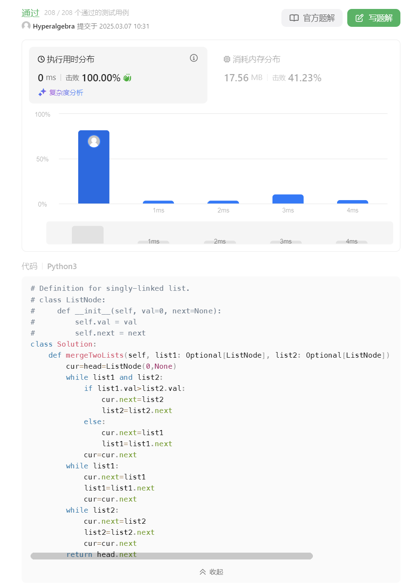
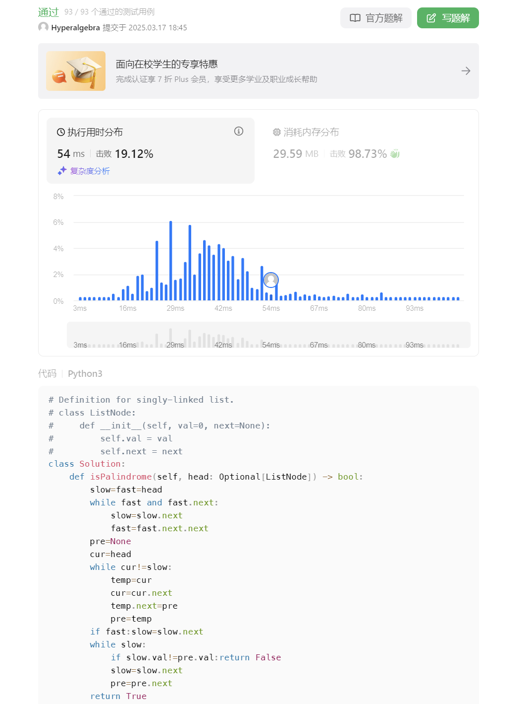
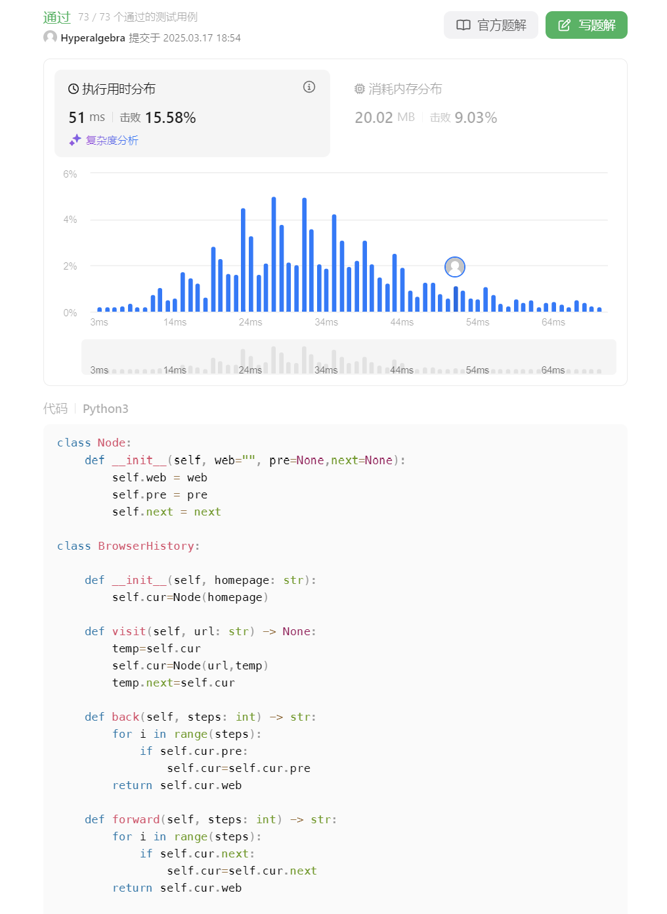
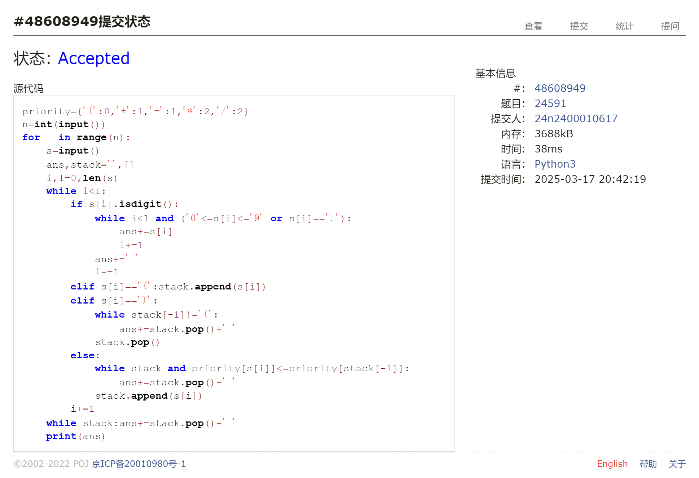
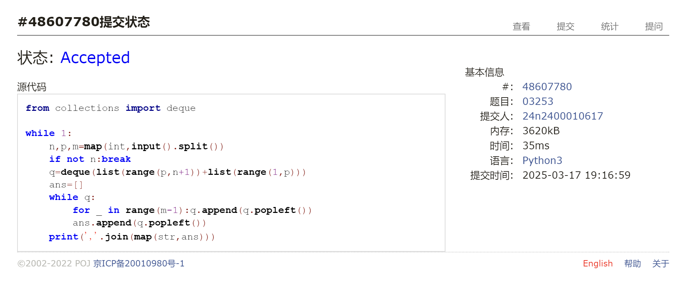
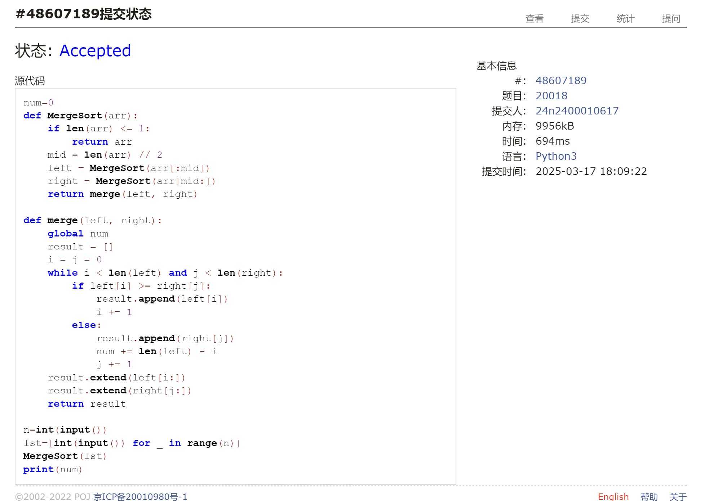

# Assignment #5: 链表、栈、队列和归并排序

Updated 1348 GMT+8 Mar 17, 2025

2025 spring, Complied by <mark>蔡沐轩 数学科学学院</mark>


> **说明：**
>
> 1. **解题与记录：**
>
>    对于每一个题目，请提供其解题思路（可选），并附上使用Python或C++编写的源代码（确保已在OpenJudge， Codeforces，LeetCode等平台上获得Accepted）。请将这些信息连同显示“Accepted”的截图一起填写到下方的作业模板中。（推荐使用Typora https://typoraio.cn 进行编辑，当然你也可以选择Word。）无论题目是否已通过，请标明每个题目大致花费的时间。
>
> 2. **提交安排：**提交时，请首先上传PDF格式的文件，并将.md或.doc格式的文件作为附件上传至右侧的“作业评论”区。确保你的Canvas账户有一个清晰可见的头像，提交的文件为PDF格式，并且“作业评论”区包含上传的.md或.doc附件。
>
> 3. **延迟提交：**如果你预计无法在截止日期前提交作业，请提前告知具体原因。这有助于我们了解情况并可能为你提供适当的延期或其他帮助。 
>
> 请按照上述指导认真准备和提交作业，以保证顺利完成课程要求。


## 1. 题目

### LC21.合并两个有序链表

linked list, https://leetcode.cn/problems/merge-two-sorted-lists/

思路：

依次比较列表头节点，决定先后顺序即可。约5min。

代码：

```python
class Solution:
    def mergeTwoLists(self, list1: Optional[ListNode], list2: Optional[ListNode]) -> Optional[ListNode]:
        cur=head=ListNode(0,None)
        while list1 and list2:
            if list1.val>list2.val:
                cur.next=list2
                list2=list2.next
            else:
                cur.next=list1
                list1=list1.next
            cur=cur.next
        while list1:
            cur.next=list1
            list1=list1.next
            cur=cur.next
        while list2:
            cur.next=list2
            list2=list2.next
            cur=cur.next
        return head.next
```


代码运行截图 <mark>（至少包含有"Accepted"）</mark>




### LC234.回文链表

linked list, https://leetcode.cn/problems/palindrome-linked-list/

<mark>请用快慢指针实现。</mark>

看了题解才知道这题的快慢指针只是用来确定中间节点的，然后反转前一半链表即可。自己之前一直觉得这个思路太繁没有尝试。约15min。

代码：

```python
class Solution:
    def isPalindrome(self, head: Optional[ListNode]) -> bool:
        slow=fast=head
        while fast and fast.next:
            slow=slow.next
            fast=fast.next.next
        pre=None
        cur=head
        while cur!=slow:
            temp=cur
            cur=cur.next
            temp.next=pre
            pre=temp
        if fast:slow=slow.next
        while slow:
            if slow.val!=pre.val:return False
            slow=slow.next
            pre=pre.next
        return True   
```


代码运行截图 <mark>（至少包含有"Accepted"）</mark>




### LC1472.设计浏览器历史记录

doubly-lined list, https://leetcode.cn/problems/design-browser-history/

<mark>请用双链表实现。</mark>

直接用双链表结构模拟即可。约5min。

（感觉用数组模拟更舒服，移动`steps`时可以直接通过索引跳转，不用写循环）

代码：

```python
class Node:
    def __init__(self, web="", pre=None,next=None):
        self.web = web
        self.pre = pre
        self.next = next

class BrowserHistory:

    def __init__(self, homepage: str):
        self.cur=Node(homepage)

    def visit(self, url: str) -> None:
        temp=self.cur
        self.cur=Node(url,temp)
        temp.next=self.cur

    def back(self, steps: int) -> str:
        for i in range(steps):
            if self.cur.pre:
                self.cur=self.cur.pre
        return self.cur.web

    def forward(self, steps: int) -> str:
        for i in range(steps):
            if self.cur.next:
                self.cur=self.cur.next
        return self.cur.web
```


代码运行截图 <mark>（至少包含有"Accepted"）</mark>




### 24591: 中序表达式转后序表达式

stack, http://cs101.openjudge.cn/practice/24591/

思路：

用栈存储运算符，数字直接存入答案，先考虑括号，再考虑优先级，先后弹出运算符即可。约15min。

代码：

```python
priority={'(':0,'+':1,'-':1,'*':2,'/':2}
n=int(input())
for _ in range(n):
    s=input()
    ans,stack='',[]
    i,l=0,len(s)
    while i<l:
        if s[i].isdigit():
            while i<l and ('0'<=s[i]<='9' or s[i]=='.'):
                ans+=s[i]
                i+=1
            ans+=' '
            i-=1
        elif s[i]=='(':stack.append(s[i])
        elif s[i]==')':
            while stack[-1]!='(':
                ans+=stack.pop()+' '
            stack.pop()
        else:
            while stack and priority[s[i]]<=priority[stack[-1]]:
                ans+=stack.pop()+' '
            stack.append(s[i])
        i+=1
    while stack:ans+=stack.pop()+' '
    print(ans)
```


代码运行截图 <mark>（至少包含有"Accepted"）</mark>




### 03253: 约瑟夫问题No.2

queue, http://cs101.openjudge.cn/practice/03253/

<mark>请用队列实现。</mark>

队列直接模拟，每次报数的人从队首弹出并塞回队尾，出圈的人弹出并记录。约5min。

代码：

```python
from collections import deque

while 1:
    n,p,m=map(int,input().split())
    if not n:break
    q=deque(list(range(p,n+1))+list(range(1,p)))
    ans=[]
    while q:
        for _ in range(m-1):q.append(q.popleft())
        ans.append(q.popleft())
    print(','.join(map(str,ans)))
```


代码运行截图 <mark>（至少包含有"Accepted"）</mark>




### 20018: 蚂蚁王国的越野跑

merge sort, http://cs101.openjudge.cn/practice/20018/

思路：

本质上就是求逆序数，直接复用之前归并排序求逆序数的代码，只要注意按递减排序即可。

代码：

```python
num=0
def MergeSort(arr):
    if len(arr) <= 1:
        return arr
    mid = len(arr) // 2
    left = MergeSort(arr[:mid])
    right = MergeSort(arr[mid:])
    return merge(left, right)

def merge(left, right):
    global num
    result = []
    i = j = 0
    while i < len(left) and j < len(right):
        if left[i] >= right[j]:
            result.append(left[i])
            i += 1
        else:
            result.append(right[j])
            num += len(left) - i
            j += 1
    result.extend(left[i:])
    result.extend(right[j:])
    return result

n=int(input())
lst=[int(input()) for _ in range(n)]
MergeSort(lst)
print(num)
```


代码运行截图 <mark>（至少包含有"Accepted"）</mark>




## 2. 学习总结和收获

<mark>如果发现作业题目相对简单，有否寻找额外的练习题目，如“数算2025spring每日选做”、LeetCode、Codeforces、洛谷等网站上的题目。</mark>

这周的作业题之前基本都做过了，但是由于加了特殊的数据结构要求，又要重新设计思路，对同样的题目也学到了新的写法。这次的LeetCode双周赛和周赛可以做到AC3了，希望自己解决难题的能力可以不断提升。
