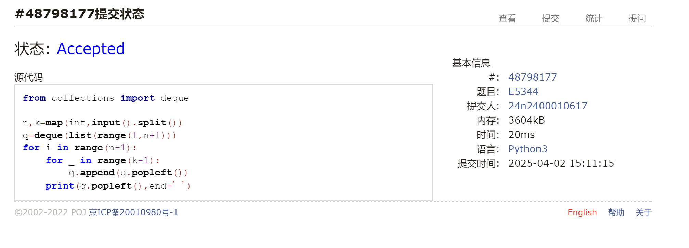
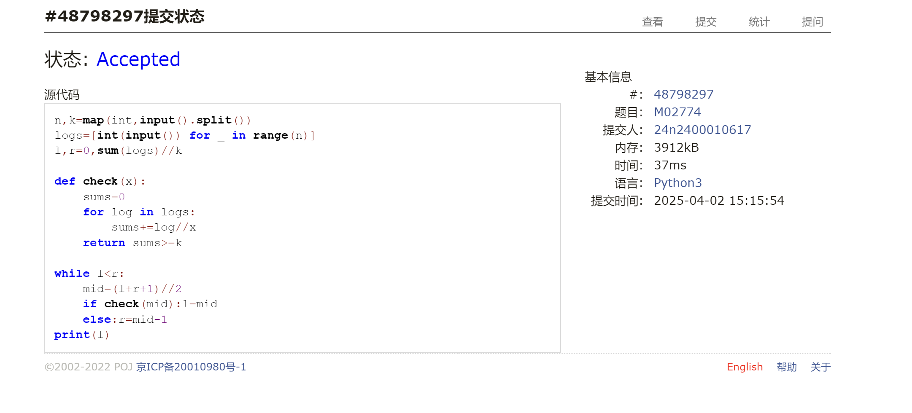
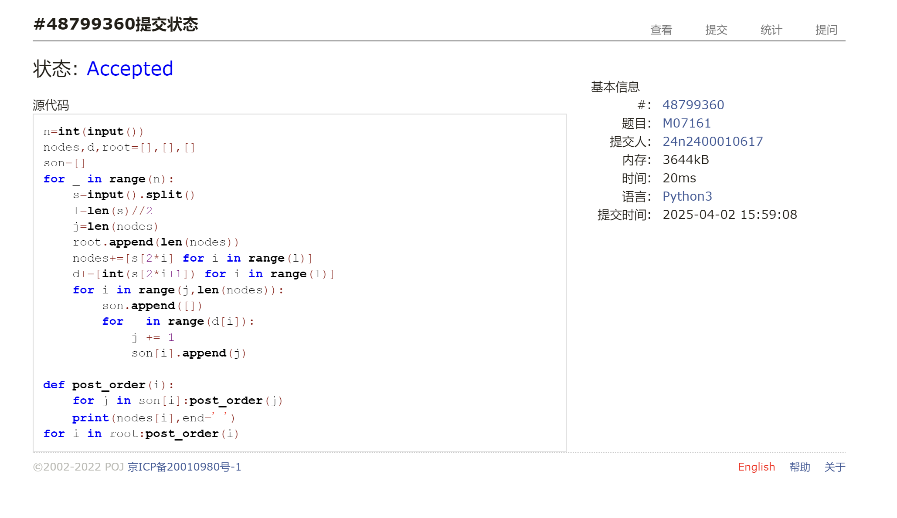
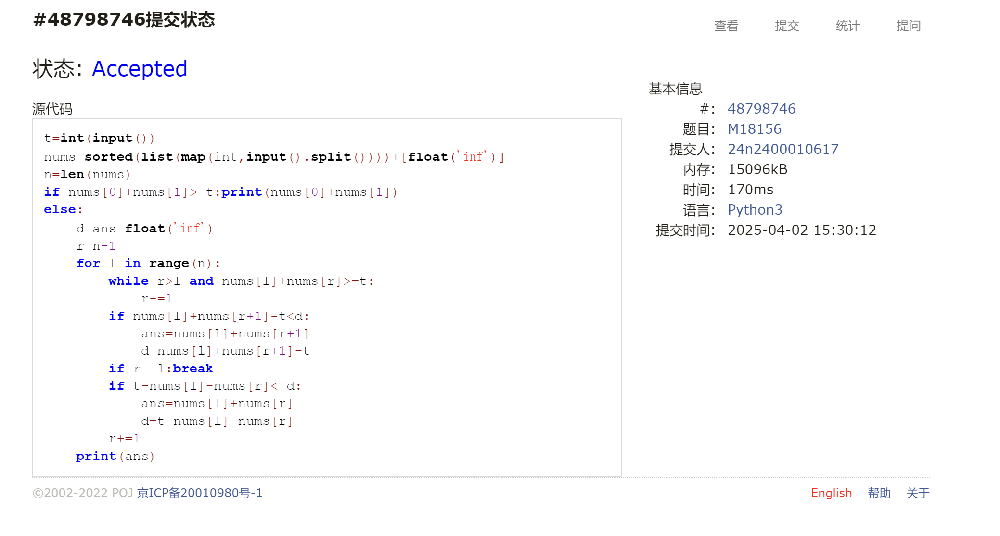
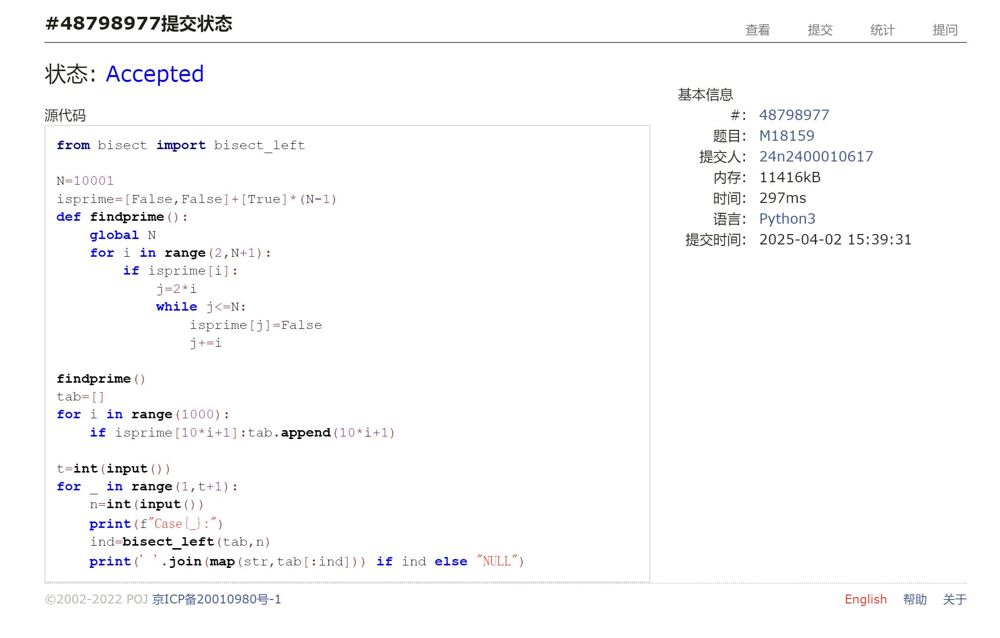
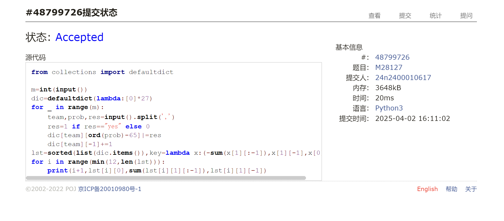

# Assignment #7: 20250402 Mock Exam

Updated 1624 GMT+8 Apr 2, 2025

2025 spring, Complied by <mark>蔡沐轩 数学科学学院</mark>


> **说明：**
>
> 1. **⽉考**：<mark>AC6</mark> 。考试题⽬都在“题库（包括计概、数算题目）”⾥⾯，按照数字题号能找到，可以重新提交。作业中提交⾃⼰最满意版本的代码和截图。
>
> 2. **解题与记录：**
>
>    对于每一个题目，请提供其解题思路（可选），并附上使用Python或C++编写的源代码（确保已在OpenJudge， Codeforces，LeetCode等平台上获得Accepted）。请将这些信息连同显示“Accepted”的截图一起填写到下方的作业模板中。（推荐使用Typora https://typoraio.cn 进行编辑，当然你也可以选择Word。）无论题目是否已通过，请标明每个题目大致花费的时间。
>
> 3. **提交安排：**提交时，请首先上传PDF格式的文件，并将.md或.doc格式的文件作为附件上传至右侧的“作业评论”区。确保你的Canvas账户有一个清晰可见的头像，提交的文件为PDF格式，并且“作业评论”区包含上传的.md或.doc附件。
>
> 4. **延迟提交：**如果你预计无法在截止日期前提交作业，请提前告知具体原因。这有助于我们了解情况并可能为你提供适当的延期或其他帮助。 
>
> 请按照上述指导认真准备和提交作业，以保证顺利完成课程要求。


## 1. 题目

### E05344:最后的最后

http://cs101.openjudge.cn/practice/05344/


思路：

约瑟夫问题，队列模拟即可。约3min。

代码：

```python
from collections import deque

n,k=map(int,input().split())
q=deque(list(range(1,n+1)))
for i in range(n-1):
    for _ in range(k-1):
        q.append(q.popleft())
    print(q.popleft(),end=' ')
```


代码运行截图 <mark>（至少包含有"Accepted"）</mark>




### M02774: 木材加工

binary search, http://cs101.openjudge.cn/practice/02774/


思路：

二分，验证每个长度能否切出至少k段。约4min。

代码：

```python
n,k=map(int,input().split())
logs=[int(input()) for _ in range(n)]
l,r=0,sum(logs)//k

def check(x):
    sums=0
    for log in logs:
        sums+=log//x
    return sums>=k

while l<r:
    mid=(l+r+1)//2
    if check(mid):l=mid
    else:r=mid-1
print(l)
```


代码运行截图 <mark>（至少包含有"Accepted"）</mark>




### M07161:森林的带度数层次序列存储

tree, http://cs101.openjudge.cn/practice/07161/


思路：

对每棵树分离出节点名称和子节点个数，记录根节点。然后在层序遍历序列中，从根节点开始依次取出相应数目的节点作为子节点即可完成建树。约20min。

代码：

```python
n=int(input())
nodes,d,root=[],[],[]
son=[]
for _ in range(n):
    s=input().split()
    l=len(s)//2
    j=len(nodes)
    root.append(len(nodes))
    nodes+=[s[2*i] for i in range(l)]
    d+=[int(s[2*i+1]) for i in range(l)]
    for i in range(j,len(nodes)):
        son.append([])
        for _ in range(d[i]):
            j += 1
            son[i].append(j)

def post_order(i):
    for j in son[i]:post_order(j)
    print(nodes[i],end=' ')
for i in root:post_order(i)
```


代码运行截图 <mark>（至少包含有"Accepted"）</mark>




### M18156:寻找离目标数最近的两数之和

two pointers, http://cs101.openjudge.cn/practice/18156/


思路：

先排序，然后双指针，右指针不断左移直到和小于t，然后右移左指针，右指针再右移一位保证和一开始大于等于t，在和跨越t时更新最小值即可。约15min。

代码：

```python
t=int(input())
nums=sorted(list(map(int,input().split())))+[float('inf')]
n=len(nums)
if nums[0]+nums[1]>=t:print(nums[0]+nums[1])
else:
    d=ans=float('inf')
    r=n-1
    for l in range(n):
        while r>l and nums[l]+nums[r]>=t:
            r-=1
        if nums[l]+nums[r+1]-t<d:
            ans=nums[l]+nums[r+1]
            d=nums[l]+nums[r+1]-t
        if r==l:break
        if t-nums[l]-nums[r]<=d:
            ans=nums[l]+nums[r]
            d=t-nums[l]-nums[r]
        r+=1
    print(ans)
```


代码运行截图 <mark>（至少包含有"Accepted"）</mark>




### M18159:个位为 1 的质数个数

sieve, http://cs101.openjudge.cn/practice/18159/


思路：

筛法找出10001以内的素数，将末位为1的存入列表，然后输出列表相应的切片即可。约9min。

代码：

```python
from bisect import bisect_left

N=10001
isprime=[False,False]+[True]*(N-1)
def findprime():
    global N
    for i in range(2,N+1):
        if isprime[i]:
            j=2*i
            while j<=N:
                isprime[j]=False
                j+=i

findprime()
tab=[]
for i in range(1000):
    if isprime[10*i+1]:tab.append(10*i+1)

t=int(input())
for _ in range(1,t+1):
    n=int(input())
    print(f"Case{_}:")
    ind=bisect_left(tab,n)
    print(' '.join(map(str,tab[:ind])) if ind else "NULL")
```


代码运行截图 <mark>（至少包含有"Accepted"）</mark>




### M28127:北大夺冠

hash table, http://cs101.openjudge.cn/practice/28127/


思路：

用`defaultdict`存储每个队伍的做题情况，默认值设为`[0]*27`，前26位记录每题是否做出，最后一位记录提交次数，按照自定义规则排序，输出前12名即可。约12min。

代码：

```python
from collections import defaultdict

m=int(input())
dic=defaultdict(lambda:[0]*27)
for _ in range(m):
    team,prob,res=input().split(',')
    res=1 if res=="yes" else 0
    dic[team][ord(prob)-65]|=res
    dic[team][-1]+=1
lst=sorted(list(dic.items()),key=lambda x:(-sum(x[1][:-1]),x[1][-1],x[0]))
for i in range(min(12,len(lst))):
    print(i+1,lst[i][0],sum(lst[i][1][:-1]),lst[i][1][-1])
```


代码运行截图  <mark>（AC代码截图，至少包含有"Accepted"）</mark>




## 2. 学习总结和收获

<mark>如果发现作业题目相对简单，有否寻找额外的练习题目，如“数算2025spring每日选做”、LeetCode、Codeforces、洛谷等网站上的题目。</mark>

这次考试思维量比较小，总体上很轻松，但感觉自己还是会在一些代码细节上出错，有几题一开始写的时候也没看清楚题目条件，WA了好几次。相比前几名的大佬，感觉自己的做题速度还需要提升。

上周的LeetCode双周赛AC4，周赛AC3，最近LeetCode的比赛题目思路都不太成问题，主要是一些比较复杂、比较长的算法写起来有点难度。比如双周赛Q4的线段树、周赛Q3的KMP都花了比较长时间调试，周赛Q4基本上知道是“当前队列中位数”的做法，但是这种较长的代码自己写起来还是比较难，最后也没能在比赛时写完。可能还得熟悉一下这些写法。

后续几周要期中考，估计花在算法上的时间会少一些了。
