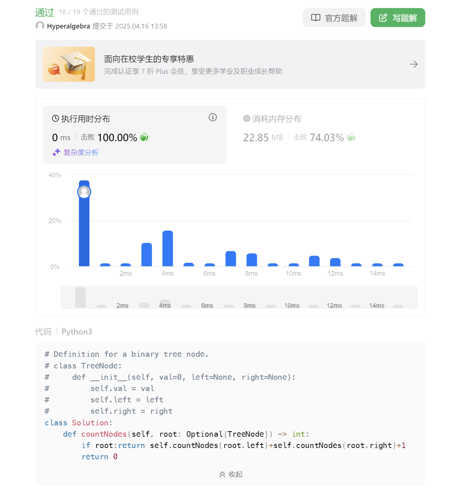
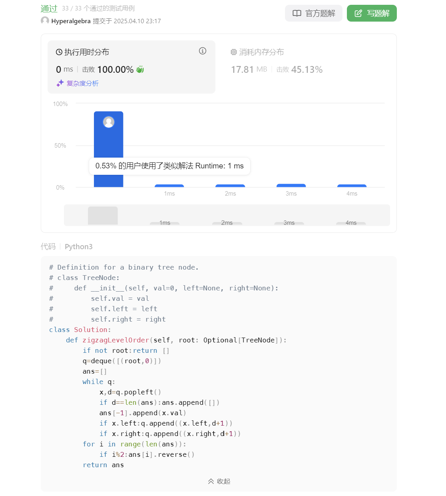
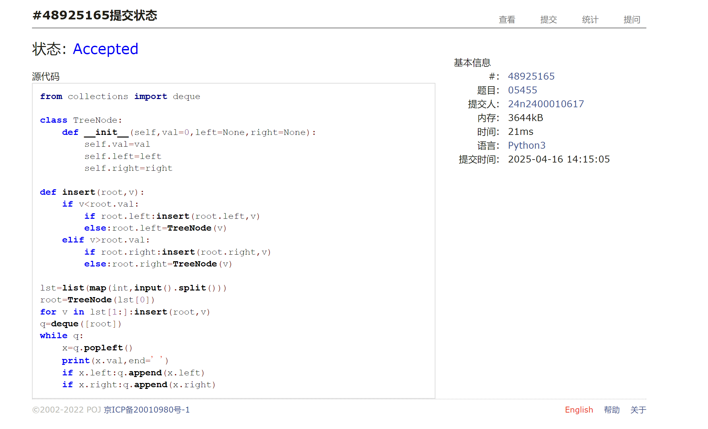
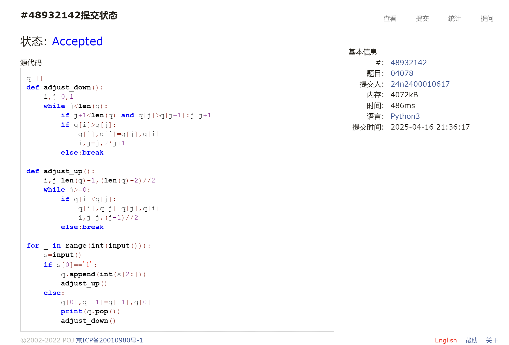
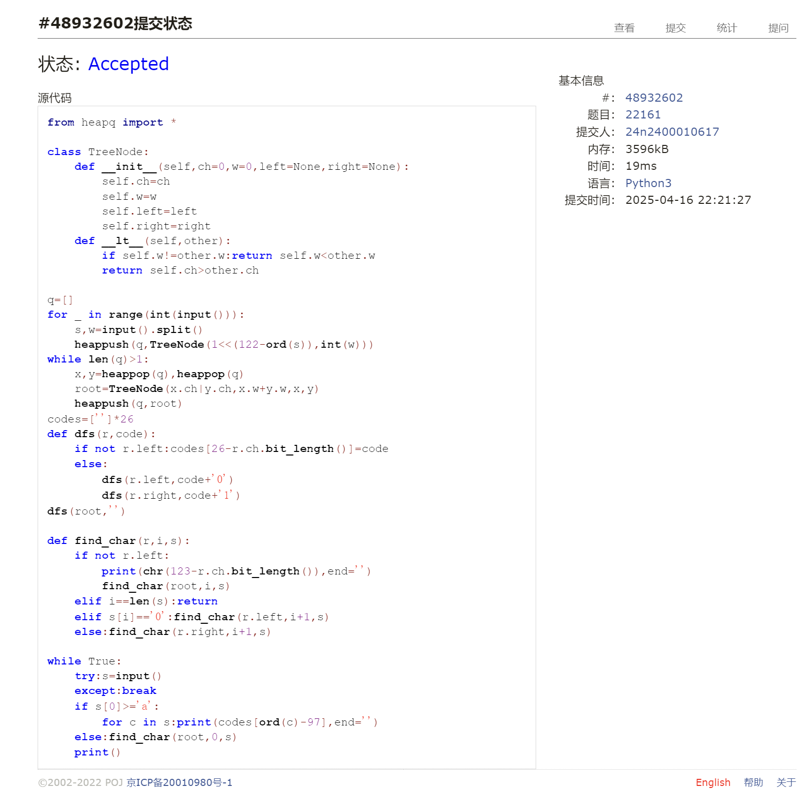

# Assignment #9: Huffman, BST & Heap

Updated 1834 GMT+8 Apr 15, 2025

2025 spring, Complied by <mark>蔡沐轩 数学科学学院</mark>


> **说明：**
>
> 1. **解题与记录：**
>
>    对于每一个题目，请提供其解题思路（可选），并附上使用Python或C++编写的源代码（确保已在OpenJudge， Codeforces，LeetCode等平台上获得Accepted）。请将这些信息连同显示“Accepted”的截图一起填写到下方的作业模板中。（推荐使用Typora https://typoraio.cn 进行编辑，当然你也可以选择Word。）无论题目是否已通过，请标明每个题目大致花费的时间。
>
> 2. **提交安排：**提交时，请首先上传PDF格式的文件，并将.md或.doc格式的文件作为附件上传至右侧的“作业评论”区。确保你的Canvas账户有一个清晰可见的头像，提交的文件为PDF格式，并且“作业评论”区包含上传的.md或.doc附件。
>
> 3. **延迟提交：**如果你预计无法在截止日期前提交作业，请提前告知具体原因。这有助于我们了解情况并可能为你提供适当的延期或其他帮助。 
>
> 请按照上述指导认真准备和提交作业，以保证顺利完成课程要求。


## 1. 题目

### LC222.完全二叉树的节点个数

dfs, https://leetcode.cn/problems/count-complete-tree-nodes/

思路：

DFS递归即可。约2min。

代码：

```python
class Solution:
    def countNodes(self, root: Optional[TreeNode]) -> int:
        if root:return self.countNodes(root.left)+self.countNodes(root.right)+1
        return 0
```


代码运行截图 <mark>（至少包含有"Accepted"）</mark>




### LC103.二叉树的锯齿形层序遍历

bfs, https://leetcode.cn/problems/binary-tree-zigzag-level-order-traversal/

思路：

BFS得出层序遍历，再将奇数层反转即可。约5min。

代码：

```python
class Solution:
    def zigzagLevelOrder(self, root: Optional[TreeNode]):
        if not root:return []
        q=deque([(root,0)])
        ans=[]
        while q:
            x,d=q.popleft()
            if d==len(ans):ans.append([])
            ans[-1].append(x.val)
            if x.left:q.append((x.left,d+1))
            if x.right:q.append((x.right,d+1))
        for i in range(len(ans)):
            if i%2:ans[i].reverse()
        return ans
```


代码运行截图 <mark>（至少包含有"Accepted"）</mark>




### M04080:Huffman编码树

greedy, http://cs101.openjudge.cn/practice/04080/

思路：

贪心，每次合并权值最小的两个节点即可。约5min。

代码：

```python
from heapq import *

n=int(input())
q=list(map(int,input().split()))
heapify(q)
ans=0
for _ in range(n-1):
    temp=heappop(q)+heappop(q)
    ans+=temp
    heappush(q,temp)
print(ans)
```


代码运行截图 <mark>（至少包含有"Accepted"）</mark>


### M05455: 二叉搜索树的层次遍历

http://cs101.openjudge.cn/practice/05455/

思路：

按输入顺序插入建立二叉搜索树，然后层序遍历输出即可。约10min。

代码：

```python
from collections import deque

class TreeNode:
    def __init__(self,val=0,left=None,right=None):
        self.val=val
        self.left=left
        self.right=right

def insert(root,v):
    if v<root.val:
        if root.left:insert(root.left,v)
        else:root.left=TreeNode(v)
    elif v>root.val:
        if root.right:insert(root.right,v)
        else:root.right=TreeNode(v)

lst=list(map(int,input().split()))
root=TreeNode(lst[0])
for v in lst[1:]:insert(root,v)
q=deque([root])
while q:
    x=q.popleft()
    print(x.val,end=' ')
    if x.left:q.append(x.left)
    if x.right:q.append(x.right)
```


代码运行截图 <mark>（至少包含有"Accepted"）</mark>




### M04078: 实现堆结构

手搓实现，http://cs101.openjudge.cn/practice/04078/

类似的题目是 晴问9.7: 向下调整构建大顶堆，https://sunnywhy.com/sfbj/9/7

思路：

插入元素向上调整，删除元素向下调整。约20min。

代码：

```python
q=[]
def adjust_down():
    i,j=0,1
    while j<len(q):
        if j+1<len(q) and q[j]>q[j+1]:j=j+1
        if q[i]>q[j]:
            q[i],q[j]=q[j],q[i]
            i,j=j,2*j+1
        else:break

def adjust_up():
    i,j=len(q)-1,(len(q)-2)//2
    while j>=0:
        if q[i]<q[j]:
            q[i],q[j]=q[j],q[i]
            i,j=j,(j-1)//2
        else:break

for _ in range(int(input())):
    s=input()
    if s[0]=='1':
        q.append(int(s[2:]))
        adjust_up()
    else:
        q[0],q[-1]=q[-1],q[0]
        print(q.pop())
        adjust_down()
```


代码运行截图 <mark>（至少包含有"Accepted"）</mark>




### T22161: 哈夫曼编码树

greedy, http://cs101.openjudge.cn/practice/22161/

思路：

用二进制储存每个节点的字符集，按贪心合并最小节点建树。先DFS一遍求出所有字母的编码，然后如果给字母串就直接查找编码输出，如果给01串就按照相应顺序在树上移动，到达叶节点时输出字符，并返回根节点重新进行下一段序列的解码。

代码：

```python
from heapq import *

class TreeNode:
    def __init__(self,ch=0,w=0,left=None,right=None):
        self.ch=ch
        self.w=w
        self.left=left
        self.right=right
    def __lt__(self,other):
        if self.w!=other.w:return self.w<other.w
        return self.ch>other.ch

q=[]
for _ in range(int(input())):
    s,w=input().split()
    heappush(q,TreeNode(1<<(122-ord(s)),int(w)))
while len(q)>1:
    x,y=heappop(q),heappop(q)
    root=TreeNode(x.ch|y.ch,x.w+y.w,x,y)
    heappush(q,root)
codes=['']*26
def dfs(r,code):
    if not r.left:codes[26-r.ch.bit_length()]=code
    else:
        dfs(r.left,code+'0')
        dfs(r.right,code+'1')
dfs(root,'')

def find_char(r,i,s):
    if not r.left:
        print(chr(123-r.ch.bit_length()),end='')
        find_char(root,i,s)
    elif i==len(s):return
    elif s[i]=='0':find_char(r.left,i+1,s)
    else:find_char(r.right,i+1,s)

while True:
    try:s=input()
    except:break
    if s[0]>='a':
        for c in s:print(codes[ord(c)-97],end='')
    else:find_char(root,0,s)
    print()
```


代码运行截图 <mark>（至少包含有"Accepted"）</mark>




## 2. 学习总结和收获

<mark>如果发现作业题目相对简单，有否寻找额外的练习题目，如“数算2025spring每日选做”、LeetCode、Codeforces、洛谷等网站上的题目。</mark>

期中考试终于结束了！

感觉这次作业做起来还是有些生疏，虽然在寒假每日选做已经做过，但是太久没用，具体算法记不清了，于是又重新学了一遍。估计这段时间做题少了，写出Bug也比较多，改了好几次才通过。周末要打打LeetCode周赛找找手感。


