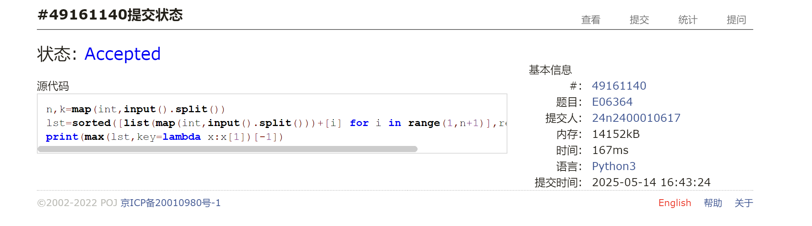
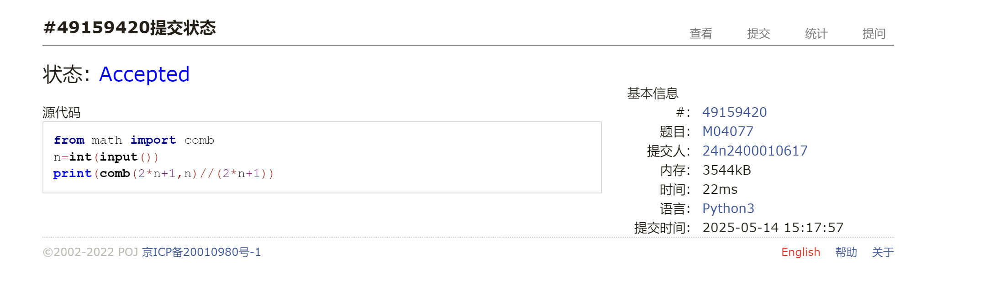
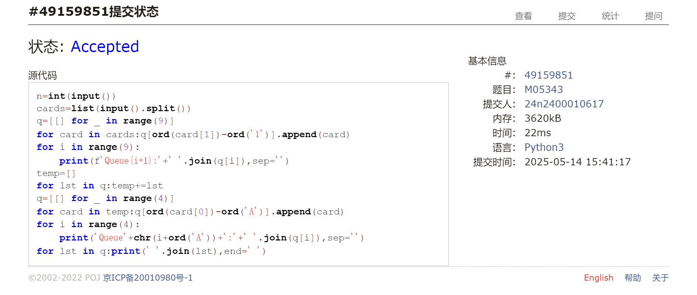
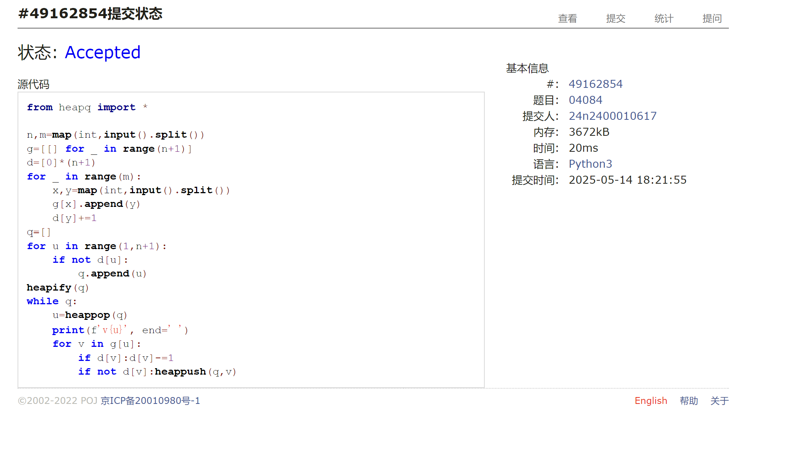
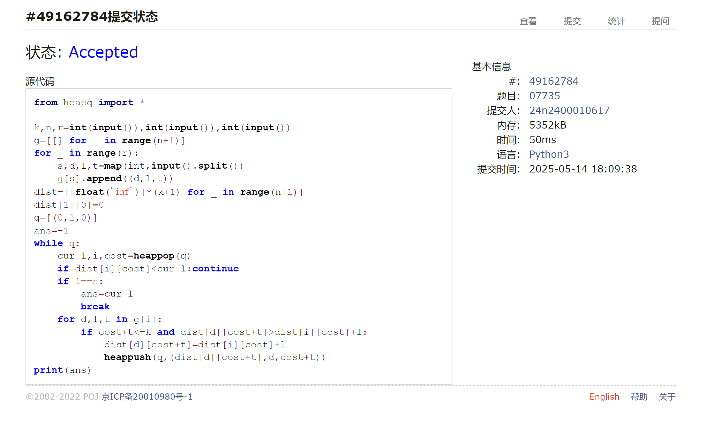
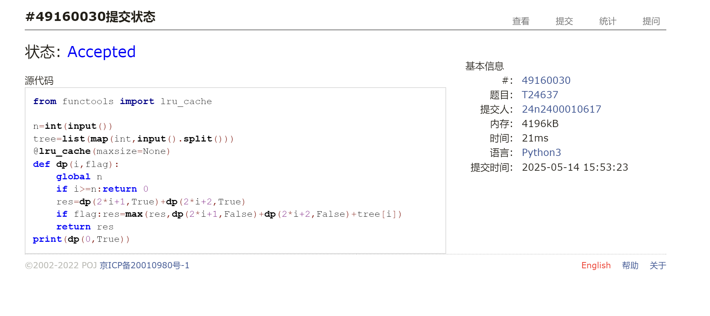

# Assignment #C: 202505114 Mock Exam

Updated 1518 GMT+8 May 14, 2025

2025 spring, Complied by <mark>蔡沐轩 数学科学学院</mark>


> **说明：**
>
> 1. **⽉考**：<mark>AC6</mark> 。考试题⽬都在“题库（包括计概、数算题目）”⾥⾯，按照数字题号能找到，可以重新提交。作业中提交⾃⼰最满意版本的代码和截图。
>
> 2. **解题与记录：**
>
>    对于每一个题目，请提供其解题思路（可选），并附上使用Python或C++编写的源代码（确保已在OpenJudge， Codeforces，LeetCode等平台上获得Accepted）。请将这些信息连同显示“Accepted”的截图一起填写到下方的作业模板中。（推荐使用Typora https://typoraio.cn 进行编辑，当然你也可以选择Word。）无论题目是否已通过，请标明每个题目大致花费的时间。
>
> 3. **提交安排：**提交时，请首先上传PDF格式的文件，并将.md或.doc格式的文件作为附件上传至右侧的“作业评论”区。确保你的Canvas账户有一个清晰可见的头像，提交的文件为PDF格式，并且“作业评论”区包含上传的.md或.doc附件。
>
> 4. **延迟提交：**如果你预计无法在截止日期前提交作业，请提前告知具体原因。这有助于我们了解情况并可能为你提供适当的延期或其他帮助。 
>
> 请按照上述指导认真准备和提交作业，以保证顺利完成课程要求。


## 1. 题目

### E06364: 牛的选举

http://cs101.openjudge.cn/practice/06364/

思路：

先按第一次票数排序，截取前k个，再按第二次票数取最大值即可。

代码：

```python
n,k=map(int,input().split())
lst=sorted([list(map(int,input().split()))+[i] for i in range(1,n+1)],reverse=True)[:k]
print(max(lst,key=lambda x:x[1])[-1])
```


代码运行截图 <mark>（至少包含有"Accepted"）</mark>




### M04077: 出栈序列统计

http://cs101.openjudge.cn/practice/04077/

思路：

相当于是每一时刻`push`操作数总大于等于`pop`操作数，且二者最后相等的序列数目，此即卡塔兰数，直接代入公式即可。

代码：

```python
from math import comb
n=int(input())
print(comb(2*n+1,n)//(2*n+1))
```


代码运行截图 <mark>（至少包含有"Accepted"）</mark>




### M05343:用队列对扑克牌排序

http://cs101.openjudge.cn/practice/05343/

思路：

按照题意逐步实现即可。

代码：

```python
n=int(input())
cards=list(input().split())
q=[[] for _ in range(9)]
for card in cards:q[ord(card[1])-ord('1')].append(card)
for i in range(9):
    print(f'Queue{i+1}:'+' '.join(q[i]),sep='')
temp=[]
for lst in q:temp+=lst
q=[[] for _ in range(4)]
for card in temp:q[ord(card[0])-ord('A')].append(card)
for i in range(4):
    print('Queue'+chr(i+ord('A'))+':'+' '.join(q[i]),sep='')
for lst in q:print(' '.join(lst),end=' ')
```


代码运行截图 <mark>（至少包含有"Accepted"）</mark>



### M04084: 拓扑排序

http://cs101.openjudge.cn/practice/04084/

思路：

只需要把通常拓扑排序里的`deque`换成`heapq`即可，其余代码照搬。

代码：

```python
from heapq import *

n,m=map(int,input().split())
g=[[] for _ in range(n+1)]
d=[0]*(n+1)
for _ in range(m):
    x,y=map(int,input().split())
    g[x].append(y)
    d[y]+=1
q=[]
for u in range(1,n+1):
    if not d[u]:
        q.append(u)
heapify(q)
while q:
    u=heappop(q)
    print(f'v{u}', end=' ')
    for v in g[u]:
        if d[v]:d[v]-=1
        if not d[v]:heappush(q,v)
```


代码运行截图 <mark>（至少包含有"Accepted"）</mark>




### M07735:道路

Dijkstra, http://cs101.openjudge.cn/practice/07735/

思路：

dijkstra，用结点下标和费用共同表示一个状态，一旦访问到结点`n`就直接跳出循环，输出答案即可。考场上没有加跳出循环的判定，也能AC，但是用时显著变长。

代码：

```python
from heapq import *

k,n,r=int(input()),int(input()),int(input())
g=[[] for _ in range(n+1)]
for _ in range(r):
    s,d,l,t=map(int,input().split())
    g[s].append((d,l,t))
dist=[[float('inf')]*(k+1) for _ in range(n+1)]
dist[1][0]=0
q=[(0,1,0)]
ans=-1
while q:
    cur_l,i,cost=heappop(q)
    if dist[i][cost]<cur_l:continue
    if i==n:
        ans=cur_l
        break
    for d,l,t in g[i]:
        if cost+t<=k and dist[d][cost+t]>dist[i][cost]+l:
            dist[d][cost+t]=dist[i][cost]+l
            heappush(q,(dist[d][cost+t],d,cost+t))
print(ans)
```


代码运行截图 <mark>（至少包含有"Accepted"）</mark>




### T24637:宝藏二叉树

dp, http://cs101.openjudge.cn/practice/24637/

思路：

标准的树上DP，用`lru_cache`来实现，递归计算`dp(i,flag)`，`i`记录当前下标，`flag`标明此节点处的宝藏是否可以获取。

代码：

```python
from functools import lru_cache

n=int(input())
tree=list(map(int,input().split()))
@lru_cache(maxsize=None)
def dp(i,flag):
    global n
    if i>=n:return 0
    res=dp(2*i+1,True)+dp(2*i+2,True)
    if flag:res=max(res,dp(2*i+1,False)+dp(2*i+2,False)+tree[i])
    return res
print(dp(0,True))
```


代码运行截图 <mark>（至少包含有"Accepted"）</mark>




## 2. 学习总结和收获

<mark>如果发现作业题目相对简单，有否寻找额外的练习题目，如“数算2025spring每日选做”、LeetCode、Codeforces、洛谷等网站上的题目。</mark>

感觉这次考试状态并不是很好，第一题因为一个变量名打错一直没有检查出来，被迫跳过，直到后面做了几题回来重写代码才过。然后是P5花了大量时间思考，一度担心Dijkstra会超时，最后勉强尝试写了一遍才发现能通过。个人觉得P6反而要比P5简单，考试的时候也是看到P6 AC的人多，才先去做了P6。整场考试足足花了一个半小时才完成。感觉自己还是要调整好状态应对期末考。


