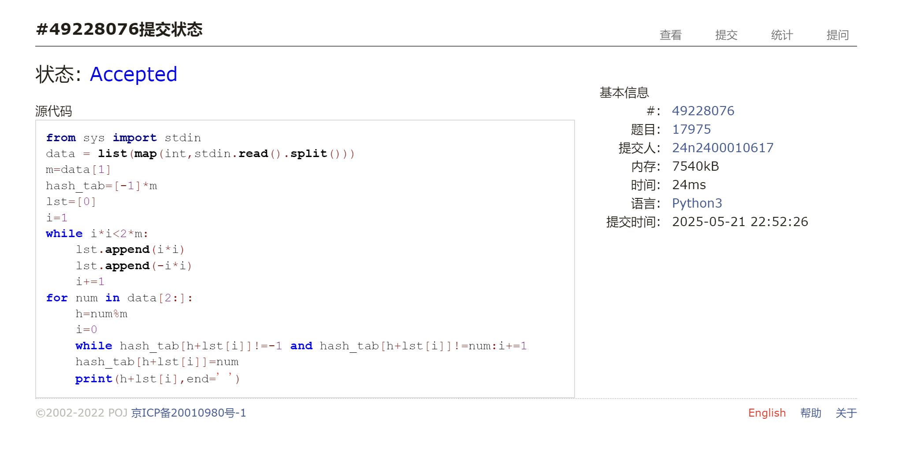
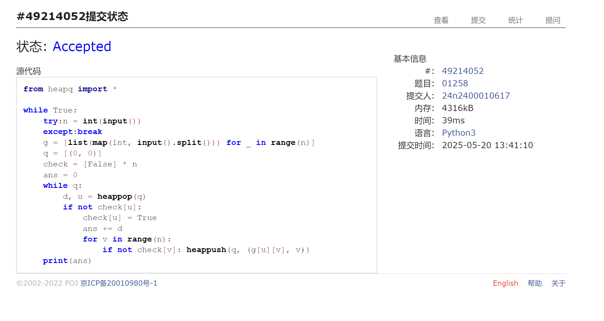
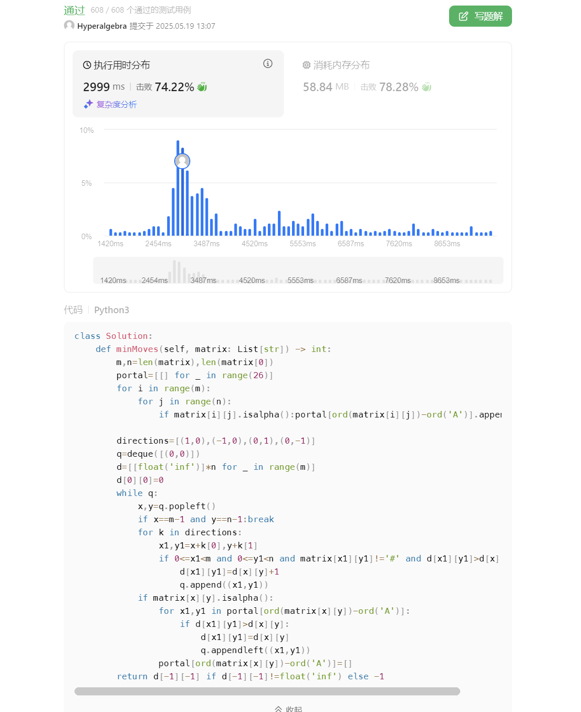
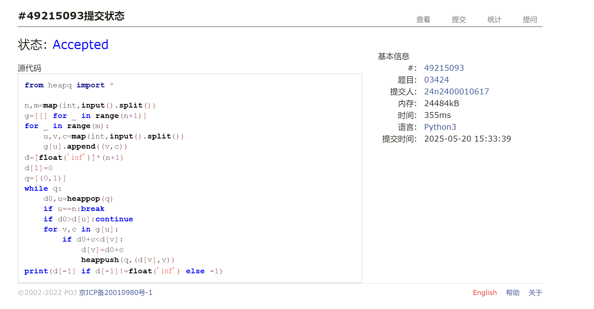
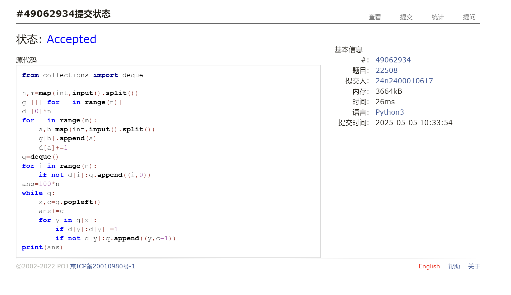

# Assignment #D: 图 & 散列表

Updated 2042 GMT+8 May 20, 2025

2025 spring, Complied by <mark>同学的姓名、院系</mark>


> **说明：**
>
> 1. **解题与记录：**
>
>    对于每一个题目，请提供其解题思路（可选），并附上使用Python或C++编写的源代码（确保已在OpenJudge， Codeforces，LeetCode等平台上获得Accepted）。请将这些信息连同显示“Accepted”的截图一起填写到下方的作业模板中。（推荐使用Typora https://typoraio.cn 进行编辑，当然你也可以选择Word。）无论题目是否已通过，请标明每个题目大致花费的时间。
>
> 2. **提交安排：**提交时，请首先上传PDF格式的文件，并将.md或.doc格式的文件作为附件上传至右侧的“作业评论”区。确保你的Canvas账户有一个清晰可见的头像，提交的文件为PDF格式，并且“作业评论”区包含上传的.md或.doc附件。
>
> 3. **延迟提交：**如果你预计无法在截止日期前提交作业，请提前告知具体原因。这有助于我们了解情况并可能为你提供适当的延期或其他帮助。 
>
> 请按照上述指导认真准备和提交作业，以保证顺利完成课程要求。


## 1. 题目

### M17975: 用二次探查法建立散列表

http://cs101.openjudge.cn/practice/17975/

<mark>需要用这样接收数据。因为输入数据可能分行了，不是题面描述的形式。OJ上面有的题目是给C++设计的，细节考虑不周全。</mark>

```python
import sys
input = sys.stdin.read
data = input().split()
index = 0
n = int(data[index])
index += 1
m = int(data[index])
index += 1
num_list = [int(i) for i in data[index:index+n]]
```


思路：

直接实现即可。

代码：

```python
from sys import stdin
data = list(map(int,stdin.read().split()))
m=data[1]
hash_tab=[-1]*m
lst=[0]
i=1
while i*i<2*m:
    lst.append(i*i)
    lst.append(-i*i)
    i+=1
for num in data[2:]:
    h=num%m
    i=0
    while hash_tab[h+lst[i]]!=-1 and hash_tab[h+lst[i]]!=num:i+=1
    hash_tab[h+lst[i]]=num
    print(h+lst[i],end=' ')
```


代码运行截图 <mark>（至少包含有"Accepted"）</mark>




### M01258: Agri-Net

MST, http://cs101.openjudge.cn/practice/01258/

思路：

Prim算法，注意处理多组数据即可。

代码：

```python
from heapq import *

while True:
    try:n = int(input())
    except:break
    g = [list(map(int, input().split())) for _ in range(n)]
    q = [(0, 0)]
    check = [False] * n
    ans = 0
    while q:
        d, u = heappop(q)
        if not check[u]:
            check[u] = True
            ans += d
            for v in range(n):
                if not check[v]: heappush(q, (g[u][v], v))
    print(ans)
```


代码运行截图 <mark>（至少包含有"Accepted"）</mark>




### M3552.网络传送门旅游

bfs, https://leetcode.cn/problems/grid-teleportation-traversal/

思路：

01bfs，走0次的放队首，走1次的放队尾，保证搜索顺序。注意用过一次的传送门直接删除，防止重复检查超时。

代码：

```python
class Solution:
    def minMoves(self, matrix: List[str]) -> int:
        m,n=len(matrix),len(matrix[0])
        portal=[[] for _ in range(26)]
        for i in range(m):
            for j in range(n):
                if matrix[i][j].isalpha():portal[ord(matrix[i][j])-ord('A')].append((i,j))

        directions=[(1,0),(-1,0),(0,1),(0,-1)]
        q=deque([(0,0)])
        d=[[float('inf')]*n for _ in range(m)]
        d[0][0]=0
        while q:
            x,y=q.popleft()
            if x==m-1 and y==n-1:break
            for k in directions:
                x1,y1=x+k[0],y+k[1]
                if 0<=x1<m and 0<=y1<n and matrix[x1][y1]!='#' and d[x1][y1]>d[x][y]+1:
                    d[x1][y1]=d[x][y]+1
                    q.append((x1,y1))
            if matrix[x][y].isalpha():
                for x1,y1 in portal[ord(matrix[x][y])-ord('A')]:
                    if d[x1][y1]>d[x][y]:
                        d[x1][y1]=d[x][y]
                        q.appendleft((x1,y1))
                portal[ord(matrix[x][y])-ord('A')]=[]
        return d[-1][-1] if d[-1][-1]!=float('inf') else -1
```


代码运行截图 <mark>（至少包含有"Accepted"）</mark>




### M787.K站中转内最便宜的航班

Bellman Ford, https://leetcode.cn/problems/cheapest-flights-within-k-stops/

思路：

Dijkstra，每个状态包含所在的节点和中转站数即可。

代码：

```python
class Solution:
    def findCheapestPrice(self, n: int, flights: List[List[int]], src: int, dst: int, k: int) -> int:
        g=[[] for _ in range(n)]
        for u,v,w in flights:g[u].append((v,w))
        d=[[float('inf')]*(k+2) for _ in range(n)]
        d[src][0]=0
        q=[(0,0,src)]
        ans=-1
        while q:
            d0,l,u=heappop(q)
            if d[u][l]<d0:continue
            if u==dst:
                ans=d0
                break
            if l<k+1:
                for v,w in g[u]:
                    if d0+w<d[v][l+1]:
                        d[v][l+1]=d0+w
                        heappush(q,(d0+w,l+1,v))
        return ans
```


代码运行截图 <mark>（至少包含有"Accepted"）</mark>


### M03424: Candies

Dijkstra, http://cs101.openjudge.cn/practice/03424/

思路：

Dijkstra，找出节点1到节点N的权值最小路径即可。

代码：

```python
from heapq import *

n,m=map(int,input().split())
g=[[] for _ in range(n+1)]
for _ in range(m):
    u,v,c=map(int,input().split())
    g[u].append((v,c))
d=[float('inf')]*(n+1)
d[1]=0
q=[(0,1)]
while q:
    d0,u=heappop(q)
    if u==n:break
    if d0>d[u]:continue
    for v,c in g[u]:
        if d0+c<d[v]:
            d[v]=d0+c
            heappush(q,(d[v],v))
print(d[-1] if d[-1]!=float('inf') else -1)
```


代码运行截图 <mark>（至少包含有"Accepted"）</mark>




### M22508:最小奖金方案

topological order, http://cs101.openjudge.cn/practice/22508/

思路：

拓扑排序，记录每个节点的层次，奖金在100的基础上增加层次相应的数值即可。

代码：

```python
from collections import deque

n,m=map(int,input().split())
g=[[] for _ in range(n)]
d=[0]*n
for _ in range(m):
    a,b=map(int,input().split())
    g[b].append(a)
    d[a]+=1
q=deque()
for i in range(n):
    if not d[i]:q.append((i,0))
ans=100*n
while q:
    x,c=q.popleft()
    ans+=c
    for y in g[x]:
        if d[y]:d[y]-=1
        if not d[y]:q.append((y,c+1))
print(ans)
```


代码运行截图 <mark>（至少包含有"Accepted"）</mark>




## 2. 学习总结和收获

<mark>如果发现作业题目相对简单，有否寻找额外的练习题目，如“数算2025spring每日选做”、LeetCode、Codeforces、洛谷等网站上的题目。</mark>

作业都是模板化的题目，比较轻松。

上周末和同学一起参加了九坤杯，还是有相当多的难题的，而且全英文题干也带来了一定阅读难度，自己一开始就因为不认识的单词没法完全理解一题的条件。我们队2个多小时才拿下第一个AC，但后期还算比较顺利，之前错误的代码反复调试后也终于通过了，自己也正好找到了比较顺手的题目完成，最后AC4，三等奖。感觉自己大一才开始接触算法，能取得这样的结果已经挺满意了。

快要期末考了，后面估计会再抽时间最后整理一遍CheatSheet。期末考要是就是之前两次月考难度的话，应该还是可以应对的。


