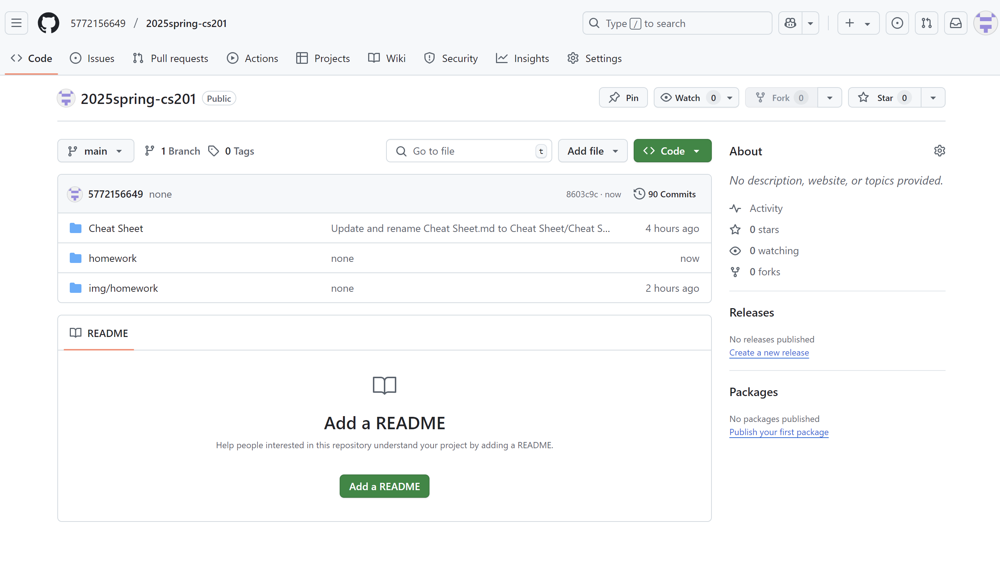

# Assignment #P: 课程大作业

Updated 1141 GMT+8 May 27, 2025

2025 spring, Complied by <mark>蔡沐轩 数学科学学院</mark>

**说明：**

关乎每位同学维护自己的 GitHub 作业，本意是让大家练习常用于计算机科学学生的代码和文档维护方法。通过计算概论、数据结构和算法等课程，我们希望引导大家进入计算机学科领域。这将帮助同学们熟悉实际的编码和文档管理流程，并培养在团队协作和版本控制方面的技能。

1）提交内容，请填写到下面作业模版中。

2）<mark>截止时间是期末出分前4天</mark>，因为Canvas可以多次提交，建议期末机考前提交一次，考试后加上课程总结再提交一次。

评分标准

| 标准           | 等级                                   | 得分       |
| -------------- | -------------------------------------- | ---------- |
| 按时提交       | 1 得分提交，0.5 得分请假，0 得分未提交 | 1 分       |
| 你的GitHub网址 | 1 得分有，0 得分无                     | 1 分       |
| 你的GitHub截图 | 1 得分有，0 得分无                     | 1 分       |
| Cheatsheet     | 1 得分有，0 得分无                     | 1 分       |
| 课程资料和情报 | 1 得分有，0 得分无                     | 1 分       |
| 总得分：       |                                        | 5 ，满分 5 |

## 1. 要求

同学开自己的GitHub，自己数算的学习方法、做的题目、考试时候要带的记录纸（cheat_sheet）等放在上面。方便大家关注，当你有新的更新时，我们也可以及时获得最新的内容。

例子1：https://github.com/forxhunter/libpku 这样的项目可以作为一个数算课程的项目，同时也是同学们整理资料的一个好方式，可以实现一举多得的效果。

例子2: https://github.com/PKUanonym/REKCARC-TSC-UHT

## 2. 提交内容

<mark>你的GitHub网址及截图</mark>。

https://github.com/5772156649/2025spring-cs201

## 3. 课程总结

如果愿意，请同学或多或少做一个本门课程的学习总结。便于之后师弟师妹跟进学习，也便于教师和助教改进教学。例如：分享自己的学习心得、笔记。

这学期的数算课程给我带来的提升还是很多的。相较于上学期，现在通过每日一题和LeetCode周赛的练习，我感觉自己能比较熟练地实现重要的树、图算法，对算法的了解也更深刻了。作为大学入学前基本没有接触过算法的学生，经过这两学期的计概和数算学习，我也逐渐感受到算法的魅力，体会到算法竞赛的趣味。个人而言，我比较喜欢思考一些略难的算法题目，对有一定技巧性的算法感兴趣，不太喜欢笔试里一些琐碎的定义、分类等，因此这门课重机考的模式还是比较合胃口的。最后感谢闫老师精心整理讲义和每日一题，让我在算法学习上有了明确的方向。之后可能不用再学习计算机相关课程了，但感觉算法思维对自己应该会有不小帮助。

关于期末机考，感觉这次的题目的区分度有点奇怪。我在P5上花了80min才做完，其中70min基本上都是困在一个误解中。主要是题目对于跨层连接的情况没有说明信号传递的顺序，题中“下一时刻将以强度Ci 向下一层传递信号”让人误解为是信号“匀速”传递，后到的信号顶替原来的信号，感觉还是得优化一下题目表述，明确是所有前置节点全部传递完信号才会引发当前节点信号更新。其实，我觉得那两题备选题反而更适合来考，题面上信息比较明确，难度也不算非常大，感觉稍微增加一点思维难度比增加阅读难度要好。

## 参考

1.科学上网 Scientific Internet

北大学长提供的Clash，请自己取用。
https://189854.xyz/verify/
https://blog.189854.xyz/blog/walless/2023/11/04/clash.html

2.图床，把图片放到云上去，而不是本地的意思。如果设置图床，分享md文件，其他人也能看到图片；否则因为md嵌入的图片在本地，只有编辑者能看到；后者的情况解决方法还可以是导出包含图片的pdf文件分享。图床如果是免费的，过一阵可能会失效，之前用过非github的免费图床，导致链接失效了。github是免费的，目前比较稳定。

1）Typora + GitHub = 效率，https://mp.weixin.qq.com/s/hmkGZln-xatrWrBZrY9t-g

2）Typora+PicGo+Github解决个人博客图片上传问题 https://zhuanlan.zhihu.com/p/367529569

3）设置的图床目录是Public

3.Github图片不显示，原因是DNS污染。两种解决方法，或者直接添加1）给出的ip列表，或者2）自己找出ip添加。

1）Github图片显示不出来？两步解决！ https://zhuanlan.zhihu.com/p/345258967?utm_id=0&wd=&eqid=ce16938700061ac4000000056470d782 。

2）https://www.ipaddress.com查到ip，添加到hosts后，在移动宽带网络中，可以显示md中的图片。 参考：解决raw.githubusercontent.com无法访问的问题（picgo+github配置图床图片不显示，但仓库已存储成功），https://blog.51cto.com/reliableyang/6457392.  

